# B. 인덱스 설계
## 요구사항
주어진 데이터셋을 활용하여 아래 조회 결과를 100ms 이하로 반환
* [x] [Coding as a Hobby](https://insights.stackoverflow.com/survey/2018#developer-profile-_-coding-as-a-hobby) 와 같은 결과를 반환하세요.
* [x] 프로그래머별로 해당하는 병원 이름을 반환하세요. (covid.id, hospital.name)
* [x] 프로그래밍이 취미인 학생 혹은 주니어(0-2년)들이 다닌 병원 이름을 반환하고 user.id 기준으로 정렬하세요. (covid.id, hospital.name, user.Hobby, user.DevType, user.YearsCoding)
* [x] 서울대병원에 다닌 20대 India 환자들을 병원에 머문 기간별로 집계하세요. (covid.Stay)
* [x] 서울대병원에 다닌 30대 환자들을 운동 횟수별로 집계하세요. (user.Exercise)

## B-1.[Coding as a Hobby](https://insights.stackoverflow.com/survey/2018#developer-profile-_-coding-as-a-hobby) 와 같은 결과를 반환하세요.

### 모든 응답


### 1차 시도
실행 시간 4.2s ~ 3.0s

인덱스는 추가하지 않고 조회 쿼리를 우선 작성해봤습니다.      
100ms까지 갈길이 머네요.

```mysql
SELECT round((hobby_count.yes_count / hobby_count.all_count)*100, 1) AS yes,
       round((hobby_count.no_count / hobby_count.all_count)*100, 1) AS no
FROM (SELECT count(case when hobby='yes' then 1 end) as yes_count,
             count(case when hobby='no' then 1 end) as no_count,
             count(*) as all_count
      FROM programmer) AS hobby_count;
```

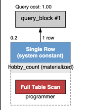
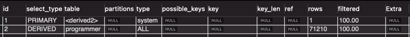

### 2차 시도
우선 programmer 의 id 컬럼에 pk 제약조건도 걸려있지 않으므로 가장 우선해서 걸어줍니다.

실행시간 0.76s ~ 0.50s

```mysql
ALTER TABLE `subway`.`programmer` 
CHANGE COLUMN `id` `id` BIGINT(20) NOT NULL ,
ADD PRIMARY KEY (`id`),
ADD UNIQUE INDEX `id_UNIQUE` (`id` ASC);


```

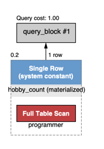
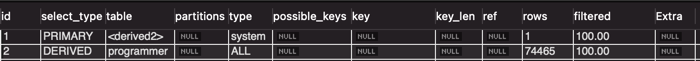

### 3차 시도
이제 hobby 컬럼에 인덱스를 걸어봅니다.

```mysql
create index `I_hobby` on subway.programmer (hobby);
```

실행시간 0.080ms ~ 0.049ms

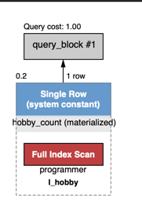
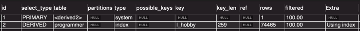

Extra를 보면 Using index로 인덱스만으로 데이터를 가져온 것을 확인할 수 있습니다.

### 전문 개발자 응답


### 1차 시도

위의 모든 응답의 데이터베이스 상태에서 이어집니다.

일단 조회 쿼리만을 작성해봤습니다.

실행 시간 2.1s ~ 1.5s

```mysql
SELECT round((hobby_count.yes_count / hobby_count.all_count)*100, 1) AS yes, 
	   round((hobby_count.no_count / hobby_count.all_count)*100, 1) AS no
FROM (SELECT count(case when hobby='yes' then 1 end) as yes_count, 
			 count(case when hobby='no' then 1 end) as no_count, 
			 count(*) as all_count
      FROM programmer
      WHERE dev_type != 'student' and dev_type != 'NA') AS hobby_count;
```

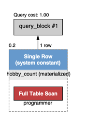
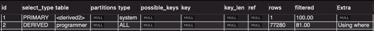

### 2차 시도
우선 dev_type 컬럼을 WHERE절에서 사용하고 있으니 여기에 인덱스를 걸어봅니다.

하지만 dev_type 컬럼의 타입이 text라서 인덱스를 걸지 못합니다.   
타입을 text -> varchar 타입으로 변경합니다.

실행시간 1.0s ~ 0.8s

실행 시간이 약간 줄어들었으나 큰 효과가 없었습니다.

```mysql
create index `I_dev_type` on subway.programmer (dev_type);
```


### 3차 시도

무엇이 문제였을까 생각해봤는데

실행 계획을 보면 전혀 인덱스를 사용하지 않고 있습니다.

WHERE 절에서 부정문 '!=' 을 사용하고 있어서 입니다.

아래와 같이 WHERE 절을 변경해줍니다.

```mysql
explain
SELECT round((hobby_count.yes_count / hobby_count.all_count)*100, 1) AS yes, 
	   round((hobby_count.no_count / hobby_count.all_count)*100, 1) AS no
FROM (SELECT count(case when hobby='yes' then 1 end) as yes_count, 
			 count(case when hobby='no' then 1 end) as no_count, 
			 count(*) as all_count
      FROM programmer
      WHERE (dev_type > 'student' or dev_type < 'student') and (dev_type > 'NA' or dev_type < 'NA')) AS hobby_count;
```

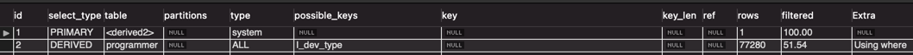

하지만 여전히 인덱스를 사용하지 않고 있습니다.

### 4차 시도

dev_type + hobby 복합 인덱스를 사용하면 인덱스를 타지 않을까? 생각했습니다.

그리고 count 안에 여러 조건을 명시할 수 있으니 WHERE 절도 안으로 옮기기로 했습니다.
(추가로 조회 쿼리도 살짝 손을 봤습니다.)

실행시간 0.110s ~ 0.080s

```mysql
SELECT (100 - round((hobby_count.no_count / hobby_count.all_count) * 100, 1)) AS yes, 
	   round((hobby_count.no_count / hobby_count.all_count) * 100, 1) AS no
FROM (SELECT count(case when hobby='no' and (dev_type > 'student' or dev_type < 'student') and (dev_type > 'NA' or dev_type < 'NA') then 1 end) as no_count,
			 count(case when (dev_type > 'student' or dev_type < 'student') and (dev_type > 'NA' or dev_type < 'NA') then 1 end) as all_count
	  FROM programmer)
AS hobby_count;
```

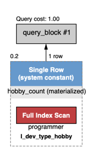
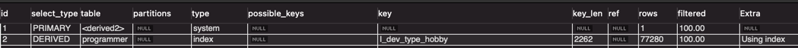

Full index scan에 적당한 조회 시간을 가지는 쿼리를 완성했습니다.

## B-2. 프로그래머별로 해당하는 병원 이름을 반환하세요. (covid.id, hospital.name)

### 1차 시도
우선 조회 쿼리부터 작성해봤습니다.
covid.id 보다 covid.programmer_id 를 반환하는게 더 자연스러운것 같아서 programmer_id를 구하는 것으로 진행했습니다.

```mysql
SELECT programmer.id, hospital.name
FROM hospital
INNER JOIN (SELECT hospital_id, programmer_id FROM covid) AS covid ON covid.hospital_id = hospital.id
INNER JOIN (SELECT id FROM programmer) AS programmer ON covid.programmer_id = programmer.id;
```

실행시간 0.023s ~ 0.013s

이미 상당히 빠른 조회시간을 가지고 있습니다.


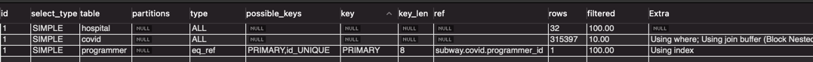

실행계획을 보면 Full Table Scan이 정말 필요한건지 인덱스를 확인해봐야합니다.

covid, hospital 둘다 인덱스가 존재하지 않습니다.

### 2차 시도

조회 쿼리를 약간 변경했습니다. programmer_id 가 covid 테이블만으로 가져올 수 있어서 programmer 테이블은 조회하지 않습니다.
```mysql
SELECT covid.programmer_id, hospital.name
FROM hospital
INNER JOIN (SELECT hospital_id, programmer_id FROM covid) AS covid ON covid.hospital_id = hospital.id
WHERE covid.programmer_id > 0;
```

covid, hospital 각각의 id에 pk 제약조건을 추가했습니다.   
hospital name 에는 추가로 unique 제약조건을 추가했습니다.

그리고 다음과 같은 인덱스를 추가했습니다.

```mysql
create index `I_id_name` on subway.hospital (id, name);
create index `I_hospitalid_programmerid` on subway.covid (hospital_id, programmer_id);
```

실행시간 0.0120s ~ 0.0080s

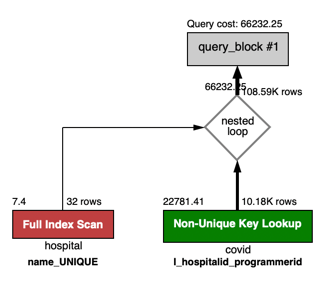
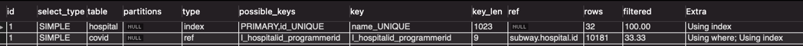

실행 계획을 보면 hospital의 'I_id_name' 인덱스를 사용하지 않고 name에 걸린 unique키를 사용하고 있는 것을 볼 수 있습니다.

unique 인덱스가 유일한 값임을 보장해주기 때문에 우선적으로 사용된다고 결론내렸습니다.

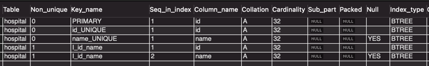

## B-3. 프로그래밍이 취미인 학생 혹은 주니어(0-2년)들이 다닌 병원 이름을 반환하고 user.id 기준으로 정렬하세요. 
**(covid.id, hospital.name, user.Hobby, user.DevType, user.YearsCoding)**

### 1차 시도

조회 쿼리만 작성

```mysql
SELECT covid.id, hospital.name, programmer.hobby, programmer.dev_type, programmer.years_coding
FROM (SELECT id, hobby, dev_type, years_coding 
	    FROM programmer 
		WHERE (student like 'yes%' or years_coding = '0-2 years') AND hobby = 'yes')
AS programmer
INNER JOIN (SELECT id, hospital_id, programmer_id FROM covid WHERE programmer_id > 0) AS covid ON programmer.id = covid.programmer_id
INNER JOIN hospital ON covid.hospital_id = hospital.id
ORDER BY programmer.id;
```

실행시간 0.0400s ~ 0.0080s

현재 programmer 인덱스


현재 hoapital 인덱스


현재 covid 인덱스

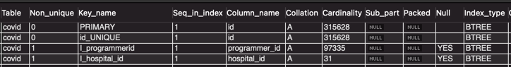

실행계획   
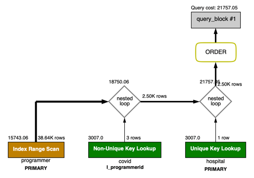
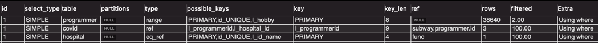

### 2차 시도

지금도 실행시간이 괜찮고 인덱스도 잘 타지만 조금 오버를 해봤습니다.

covid에 커버링 인덱스를 만들어주고 싶었습니다.

```mysql
create index `I_pid_hid_id` on covid (programmer_id, hospital_id, id);
```

실행시간 0.0400s ~ 0.0070s

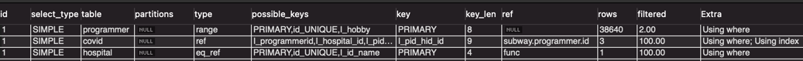

### 3차 시도(잘못된 조건 수정)

programmer테이블에 대한 조건이 잘못 설정되서 수정했습니다!

```mysql
SELECT covid.id, hospital.name, programmer.hobby, programmer.dev_type, programmer.years_coding
FROM (SELECT id, hobby, dev_type, years_coding 
		FROM programmer 
		WHERE (student like 'yes%' AND hobby = 'yes') OR years_coding = '0-2 years')
AS programmer
INNER JOIN (SELECT id, hospital_id, programmer_id FROM covid WHERE programmer_id > 0) AS covid ON programmer.id = covid.programmer_id
INNER JOIN hospital ON covid.hospital_id = hospital.id
ORDER BY programmer.id;
```

실행시간 0.060s ~ 0.010s

## B-4. 서울대병원에 다닌 20대 India 환자들을 병원에 머문 기간별로 집계하세요. (covid.Stay)

### 1차 시도

조회쿼리 작성입니다.

실행시간 0.220s ~ 0.100s

목표인 100ms에 근접하지 못했습니다.

또한 member 테이블에 pk에 대한 인덱스만 존재하는 상태입니다.

```mysql
SELECT covid.stay, count(*)
FROM (SELECT id FROM hospital WHERE name = '서울대병원') AS hospital
INNER JOIN (SELECT member_id, hospital_id, stay FROM covid WHERE member_id > 0) AS covid ON covid.hospital_id = hospital.id
INNER JOIN (SELECT id FROM member WHERE age >= 20 and age < 30) AS member ON covid.member_id = member.id
GROUP BY covid.stay;
```

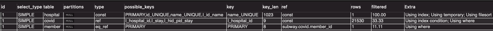


### 2차시도

어디를 튜닝해야할까 살펴보니 
* member 테이블에 인덱스 걸어줄만한 컬럼은 없는지?
* file sort 가 일어나고 있습니다.

group by를 하면 자동으로 file sort가 일어납니다.   
이때 file sort는 ORDER BY null 을 추가해서 없앨 수 있습니다.   
결과적으로 정렬은 수행하지않고 grouping만 일어나도록 하는것입니다.  
**이것은 표준이 아니라 mysql에서만 구현해놓은 방식입니다.**
[GROUP BY의 Filesort 작업 제거](http://intomysql.blogspot.com/2010/12/group-by-filesort.html)

```mysql
SELECT covid.stay, count(*)
FROM (SELECT id FROM hospital WHERE name = '서울대병원') AS hospital
INNER JOIN (SELECT member_id, hospital_id, stay FROM covid WHERE member_id > 0) AS covid ON covid.hospital_id = hospital.id
INNER JOIN (SELECT id FROM member WHERE age >= 20 and age < 30) AS member ON covid.member_id = member.id
GROUP BY covid.stay;
ORDER BY null;
```

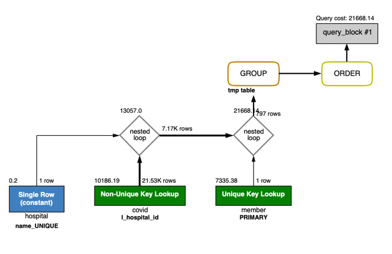

covid에 커버링 인덱스를 추가할 수 있습니다.

```mysql
create index `I_hid_mid_stay` on covid (hospital_id, member_id, stay);
```

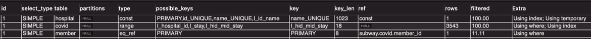

covid에 커버링 인덱스를 추가하면 index range scan를 하고 Using Index를 하는것을 볼 수 있습니다. 

실행시간이 상당히 줄어들었습니다.

실행시간 0.060s ~ 0.024s

다음으로 member 테이블의 age 에 인덱스를 걸어봤습니다.  
cardinality는 낮지만 일단 추가해봤습니다.   

하지만 옵티마이저가 쳐다보지도 않습니다.
filtered가 늘어나긴 했지만 성능에 큰 영향을 미치고있진 않습니다.
(filtered가 왜 늘어났을까요?..)

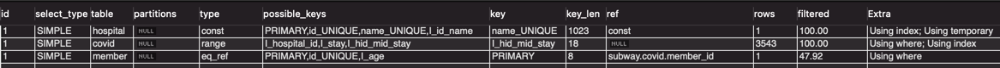

age에 걸었던 인덱스는 큰 효과를 내지 못하므로 사용하지 않았습니다.

## B-5. 서울대병원에 다닌 30대 환자들을 운동 횟수별로 집계하세요. (user.Exercise)

### 1차 시도

조회 쿼리 작성

실행시간 4.0s ~ 2.2s

```mysql
SELECT programmer.exercise, count(*)
FROM (SELECT id FROM hospital WHERE name = '서울대병원') AS hospital
INNER JOIN (SELECT programmer_id, member_id, hospital_id FROM covid WHERE member_id > 0) AS covid ON covid.hospital_id = hospital.id
INNER JOIN (SELECT id FROM member WHERE age < 40 and age >= 30) AS member ON covid.member_id = member.id
INNER JOIN programmer ON covid.programmer_id = programmer.id
GROUP BY programmer.exercise
ORDER BY null;
```

;
```

* programmer의 member_id, exercise 로 커버링 인덱스 만들기

```mysql
create index `I_member_id_exercise` on programmer (member_id, exercise);
```

실행시간 0.080s ~ 0.039s

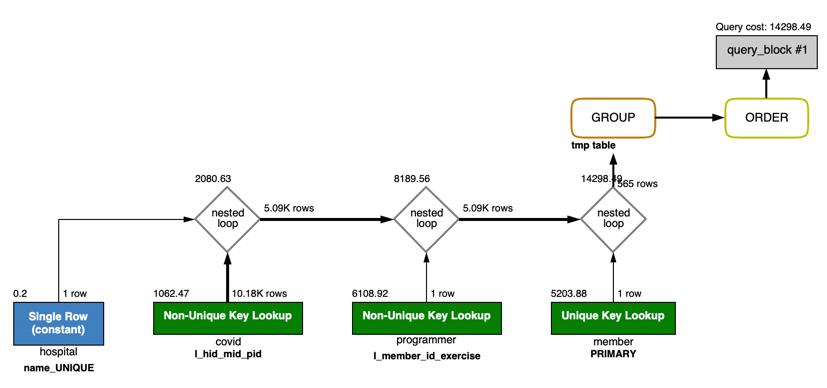
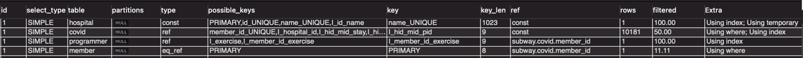

* member의 age 컬럼에 인덱스를 걸어봤지만 역시나 큰 효율이 없어서 제거
* 현 상태에서 programmer 테이블의 member_id 컬럼에 unique 제약조건을 줘서 member_id의 unique 인덱스를 만들면 성능이 약간 떨어지는 이슈가..?
