# B. 인덱스 설계
## 요구사항
주어진 데이터셋을 활용하여 아래 조회 결과를 100ms 이하로 반환
* [x] [Coding as a Hobby](https://insights.stackoverflow.com/survey/2018#developer-profile-_-coding-as-a-hobby) 와 같은 결과를 반환하세요.
* [ ] 프로그래머별로 해당하는 병원 이름을 반환하세요. (covid.id, hospital.name)
* [ ]프로그래밍이 취미인 학생 혹은 주니어(0-2년)들이 다닌 병원 이름을 반환하고 user.id 기준으로 정렬하세요. (covid.id, hospital.name, user.Hobby, user.DevType, user.YearsCoding)
* [ ] 서울대병원에 다닌 20대 India 환자들을 병원에 머문 기간별로 집계하세요. (covid.Stay)
* [ ] 서울대병원에 다닌 30대 환자들을 운동 횟수별로 집계하세요. (user.Exercise)

## B-1.[Coding as a Hobby](https://insights.stackoverflow.com/survey/2018#developer-profile-_-coding-as-a-hobby) 와 같은 결과를 반환하세요.

### 모든 응답
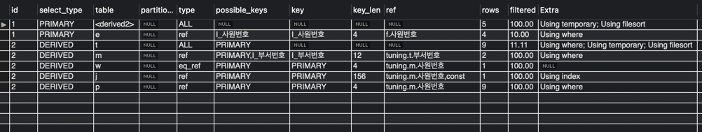

### 1차 시도
실행 시간 4.2s ~ 3.0s

인덱스는 추가하지 않고 조회 쿼리를 우선 작성해봤습니다.      
100ms까지 갈길이 머네요.

```mysql
SELECT round((hobby_count.yes_count / hobby_count.all_count)*100, 1) AS yes,
       round((hobby_count.no_count / hobby_count.all_count)*100, 1) AS no
FROM (SELECT count(case when hobby='yes' then 1 end) as yes_count,
             count(case when hobby='no' then 1 end) as no_count,
             count(*) as all_count
      FROM programmer) AS hobby_count;
```

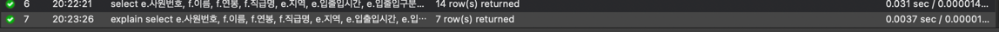
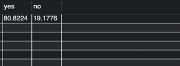

### 2차 시도
우선 programmer 의 id 컬럼에 pk 제약조건도 걸려있지 않으므로 가장 우선해서 걸어줍니다.

실행시간 0.76s ~ 0.50s

```mysql
ALTER TABLE `subway`.`programmer` 
CHANGE COLUMN `id` `id` BIGINT(20) NOT NULL ,
ADD PRIMARY KEY (`id`),
ADD UNIQUE INDEX `id_UNIQUE` (`id` ASC);


```

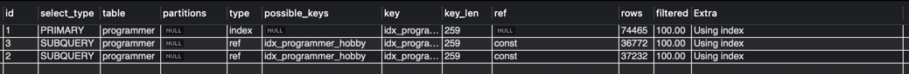
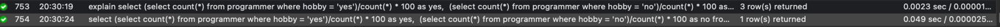

### 3차 시도
이제 hobby 컬럼에 인덱스를 걸어봅니다.

```mysql
create index `I_hobby` on subway.programmer (hobby);
```

실행시간 0.080ms ~ 0.049ms

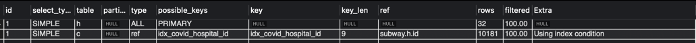


Extra를 보면 Using index로 인덱스만으로 데이터를 가져온 것을 확인할 수 있습니다.

### 전문 개발자 응답
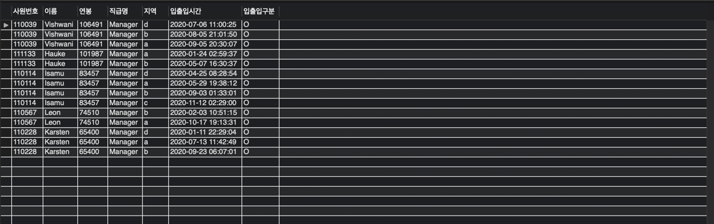

### 1차 시도

위의 모든 응답의 데이터베이스 상태에서 이어집니다.

일단 조회 쿼리만을 작성해봤습니다.

실행 시간 2.1s ~ 1.5s

```mysql
SELECT round((hobby_count.yes_count / hobby_count.all_count)*100, 1) AS yes, 
	   round((hobby_count.no_count / hobby_count.all_count)*100, 1) AS no
FROM (SELECT count(case when hobby='yes' then 1 end) as yes_count, 
			 count(case when hobby='no' then 1 end) as no_count, 
			 count(*) as all_count
      FROM programmer
      WHERE dev_type != 'student' and dev_type != 'NA') AS hobby_count;
```

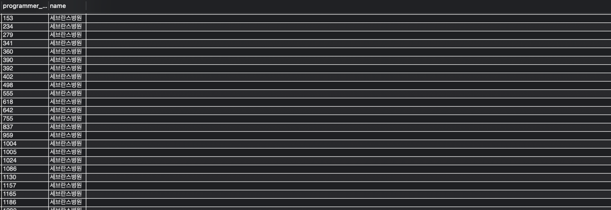
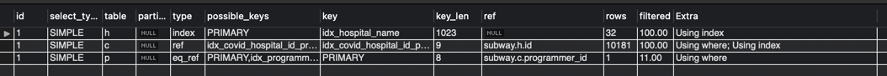

### 2차 시도
우선 dev_type 컬럼을 WHERE절에서 사용하고 있으니 여기에 인덱스를 걸어봅니다.

하지만 dev_type 컬럼의 타입이 text라서 인덱스를 걸지 못합니다.   
타입을 text -> varchar 타입으로 변경합니다.

실행시간 1.0s ~ 0.8s

실행 시간이 약간 줄어들었으나 큰 효과가 없었습니다.

```mysql
create index `I_dev_type` on subway.programmer (dev_type);
```

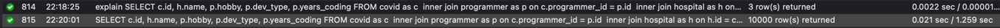
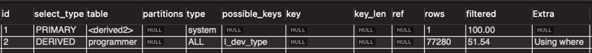

### 3차 시도

무엇이 문제였을까 생각해봤는데

실행 계획을 보면 전혀 인덱스를 사용하지 않고 있습니다.

WHERE 절에서 부정문 '!=' 을 사용하고 있어서 입니다.

아래와 같이 WHERE 절을 변경해줍니다.

```mysql
explain
SELECT round((hobby_count.yes_count / hobby_count.all_count)*100, 1) AS yes, 
	   round((hobby_count.no_count / hobby_count.all_count)*100, 1) AS no
FROM (SELECT count(case when hobby='yes' then 1 end) as yes_count, 
			 count(case when hobby='no' then 1 end) as no_count, 
			 count(*) as all_count
      FROM programmer
      WHERE (dev_type > 'student' or dev_type < 'student') and (dev_type > 'NA' or dev_type < 'NA')) AS hobby_count;
```

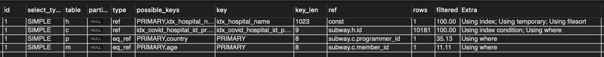

하지만 여전히 인덱스를 사용하지 않고 있습니다.

### 4차 시도

dev_type + hobby 복합 인덱스를 사용하면 인덱스를 타지 않을까? 생각했습니다.

그리고 count 안에 여러 조건을 명시할 수 있으니 WHERE 절도 안으로 옮기기로 했습니다.
(추가로 조회 쿼리도 살짝 손을 봤습니다.)

실행시간 0.110s ~ 0.080s

```mysql
SELECT (100 - round((hobby_count.no_count / hobby_count.all_count) * 100, 1)) AS yes, 
	   round((hobby_count.no_count / hobby_count.all_count) * 100, 1) AS no
FROM (SELECT count(case when hobby='no' and (dev_type > 'student' or dev_type < 'student') and (dev_type > 'NA' or dev_type < 'NA') then 1 end) as no_count,
			 count(case when (dev_type > 'student' or dev_type < 'student') and (dev_type > 'NA' or dev_type < 'NA') then 1 end) as all_count
	  FROM programmer)
AS hobby_count;
```

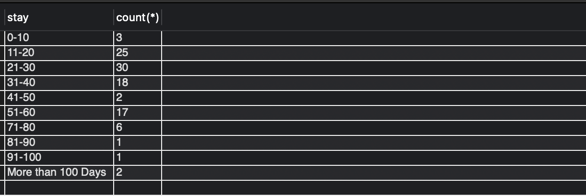
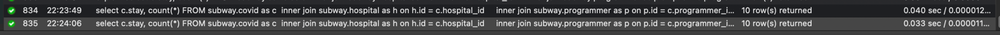

Full index scan에 적당한 조회 시간을 가지는 쿼리를 완성했습니다.

##


