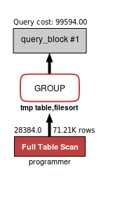
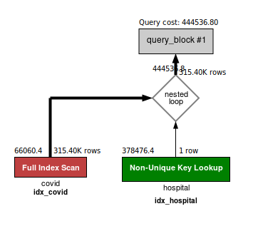
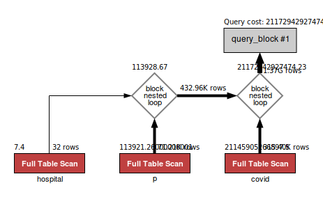
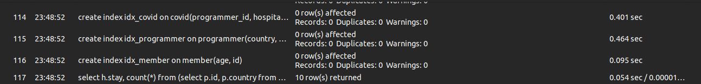
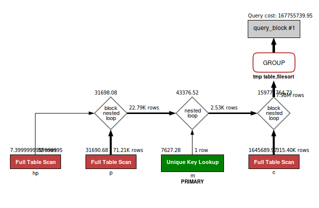
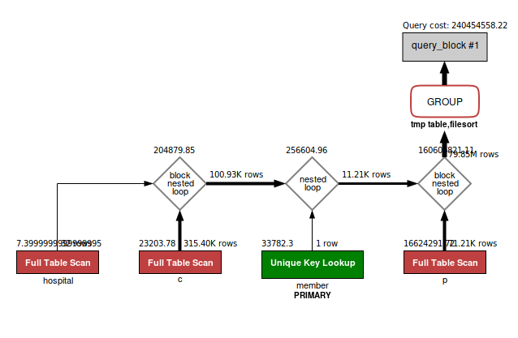

# B. 인덱스 설계

## Coding as Hobby

```SQL
CREATE INDEX hobby_idx ON programmer(hobby);  
```

```SQL
SELECT hobby, count(*) / (SELECT count(*) FROM programmer) "Coding as a Hobby" FROM programmer GROUP BY hobby;  
```

  
<br>
  

## 각 프로그래머별로 해당하는 병원 이름을 반환하세요

```SQL
CREATE INDEX idx_hospital ON hospital(id);  
CREATE INDEX idx_covid ON covid(programmer_id, hospital_id);  
```

```SQL
SELECT covid.programmer_id, hospital.name FROM covid, hospital WHERE covid.hospital_id = hospital.id;  
```
  
<br>
  

## 프로그래밍이 취미인 학생 혹은 주니어(0~2년)들이 다닌 병원 이름을 반환하고 user.id 기준으로 정렬하세요.  

```SQL
CREATE INDEX idx_hospital ON hospital(id);  
CREATE INDEX idx_covid ON covid(programmer_id, hospital_id);  
CREATE INDEX idx_programmer ON programmer(hobby, years_coding);  
```
```SQL
SELECT d.id, h.name, d.hobby, d.dev_type, d.years_coding FROM  
(SELECT p.id, p.hobby, p.dev_type, p.years_coding FROM programmer p WHERE p.hobby = "yes" OR p.years_coding = "0-2 year" ORDER BY id) d,  
(SELECT covid.programmer_id id, hospital.name name FROM covid, hospital WHERE covid.hospital_id = hospital.id) h WHERE d.id = h.id;  
```

  
<br>
  


## 서울대병원에 다닌 20대 India 환자들을 병원에 머문 기간별로 집계하세요.
이 부분에서는 Index에 대해서 많이 고민을 하였던 것 같아요.  
왜냐하면 Text는 index로 사용을 할 수 없다고 안내를 받았습니다.  
그 때문에 [sql-server-index-on-text-column](https://stackoverflow.com/questions/830241/sql-server-index-on-text-column)라는 글의 도움을 받아,   Text들을 varchar(255)로 형태로 DB를 수정한 다음 Index를 만들어 실행하게 되었습니다.  
또한, 여기서부터 성능 개선이 잘 되지 않아서, 서브 쿼리 대신에 join을 적극적으로 사용하게 되었습니다.  

```SQL
ALTER TABLE hospital MODIFY name VARCHAR(255);  
CREATE INDEX idx_hospital ON hospital(id);  
CREATE INDEX idx_covid ON covid(programmer_id, hospital_id);  
CREATE INDEX idx_programmer ON programmer(country, member_id, id);  
CREATE INDEX idx_member ON member(age, id);  
```

```SQL
SELECT h.stay, count(*) FROM  
(SELECT p.id, p.country FROM programmer p JOIN member AS m ON m.id = p.member_id WHERE m.age BETWEEN 20 AND 29 AND p.country ="India") d,  
(SELECT c.programmer_id id, hp.name, c.stay stay FROM covid c JOIN hospital AS hp ON c.hospital_id = hp.id WHERE hp.name= "서울대병원") h  
WHERE d.id = h.id GROUP BY h.stay;  
```

  
<br>
  


## 서울대 병원에 다닌 30대 환자들을 운동 횟수별로 집계하세요 .

```SQL
ALTER TABLE programmer MODIFY exercise VARCHAR(255);  
CREATE INDEX idx_hospital ON hospital(name, id);  
CREATE INDEX idx_covid ON covid(programmer_id, hospital_id);  
CREATE INDEX idx_programmer ON programmer(member_id, id, exercise);  
CREATE INDEX idx_member ON member(age, id);  
```

```SQL
SELECT d.exercise, count(*) FROM  
(SELECT m.id, p.exercise FROM programmer p  
JOIN (SELECT id FROM member WHERE age BETWEEN 30 AND 39) AS m ON m.id = p.member_id) d  
JOIN (SELECT c.member_id id, c.stay stay FROM covid c, (SELECT id FROM hospital WHERE name = "서울대병원") h  
WHERE c.hospital_id = h.id) hp ON d.id = hp.id GROUP BY d.exercise;  
```

  
<br>
  
