# Mission 제출 답안

## A. 쿼리 연습
### [1. 쿼리 작성만으로 1s 이하로 반환한다]
- **결과**
    - [A 문제 쿼리 응답](https://github.com/PapimonLikelion/sql-tuning/blob/main/answer/a.txt)

- **다음과 같이 쿼리를 작성했어요**
    ```mysql
    select 사원.사원번호, 사원.이름, 부서관리자_급여.연봉, 직급.직급명, 사원출입기록.입출입시간, 사원출입기록.지역, 사원출입기록.입출입구분
    from (select 부서관리자.사원번호, 급여.연봉
            from 부서관리자
                JOIN 급여 ON 부서관리자.사원번호 = 급여.사원번호
            where 부서관리자.부서번호 
                 in (select 부서번호 from 부서 where LOWER(비고) = 'active') 
                 and 부서관리자.종료일자 > NOW()
                 and 급여.종료일자 > NOW()
            order by 급여.연봉 DESC 
            LIMIT 5) 부서관리자_급여 
        JOIN 사원
            ON 부서관리자_급여.사원번호 = 사원.사원번호
        JOIN 직급
            ON 부서관리자_급여.사원번호 = 직급.사원번호
        JOIN 사원출입기록
            ON 부서관리자_급여.사원번호 = 사원출입기록.사원번호
    where
        직급.종료일자 > NOW() and
        사원출입기록.입출입구분 = 'O'
    order by
        부서관리자_급여.연봉 DESC, 
        사원출입기록.지역;
    ```

- **다음과 같이 결과가 조회돼요**
    - 대략 0.3 sec가 소요됐어요
    - 

- **실행계획은 다음과 같아요**
    - 
    - 
    - where 절의 `사원출입기록.입출입구분 = 'O'` 가 테이블 풀 스캔으로 데이터 접근해요
    - order by 절의 `부서관리자_급여.연봉` 도 데이터 풀 스캔으로 데이터 접근해요
    - extra 칼럼에는 using index가 하나도 없어요
        - using temporary
        - using filesort
        - using where

### [2. 인덱스 설정을 추가하여 50 ms 이하로 반환한다]
- **일단 테이블 풀 스캔을 없애보기로 했어요**
    - ``create index `입출입구분` ON 사원출입기록 (입출입구분);``
    - 조금 줄어서 0.2sec 정도 소요
    - 
    - 실행 계획을 보니 여전히 사원출입기록은 너무 많이 Row를 읽어와요
        - 

- **사원출입기록에 사원번호, 입출입구분 두 가지 칼럼에 대해 인덱스를 걸어보았어요**
    - ``drop index `입출입구분` ON 사원출입기록;``
    - ``create index `사원번호_입출입구분` ON 사원출입기록 (사원번호, 입출입구분);``
    - 시간이 많이 줄었어요
        - 대략 0.000sec ~ 0.015sec 정도로 계산되어요
        - 
    - 실행계획에서도 사원출입기록에서 조회해오는 Row가 2개로 감소한 것을 확인할 수 있어요.
        - 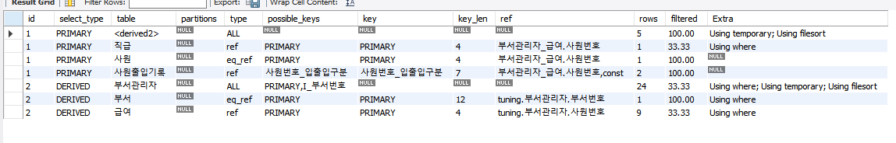
        - 

### B. 인덱스 설계
### [1. Coding as a Hobby 와 같은 결과를 반환하세요.]
- **결과**
    - [B-1 문제 쿼리 응답](https://github.com/PapimonLikelion/sql-tuning/blob/main/answer/b-1.txt)

- **다음과 같은 값이 나와야 해요**
    - 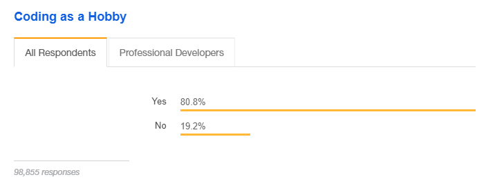

- **다음과 같이 쿼리를 작성했어요**
    ``` mysql
    select
        CONCAT( CAST( ROUND((((select count(*) from programmer where hobby = "Yes") / (select count(*) from programmer)) * 100), 1) AS CHAR(4)), "%") AS `Yes`,
        CONCAT( CAST( ROUND((((select count(*) from programmer where hobby = "No") / (select count(*) from programmer)) * 100), 1) AS CHAR(4)), "%") AS `No`;
    ```
    - 인덱스를 적용하지 않은 경우, 대략 650ms 갸량 소요되어요
        - 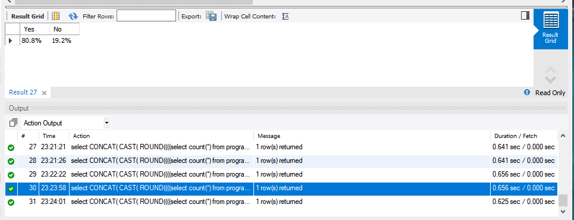

- **인덱스를 적용해볼게요**
    - 현재로서는 인덱스가 전혀 적용되어 있지 않아요
    - hobby와 id를 혼합하여 다중 컬럼 인덱스를 만들었어요
        - ``create index `hobby_id` on programmer (`hobby`, `id`);`` 
        - 사실 hobby가 yes/no로 만 나뉘어 카디널리티가 높지 않아서 효율성이 걱정됩니다
        - 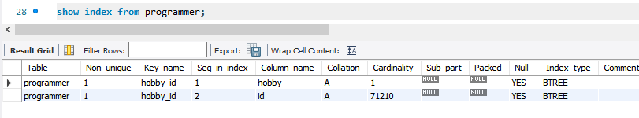
    - 인덱스 적용 후, 대략 80ms~90ms 정도 소요되어요
        - 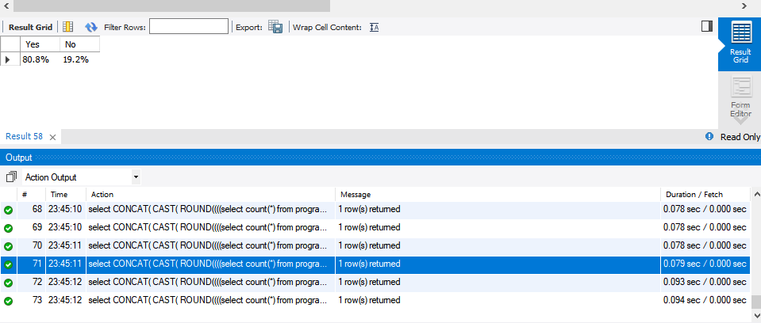
    - 실행 계획도 인덱스를 사용하는 방식으로 변경되었어요
        - 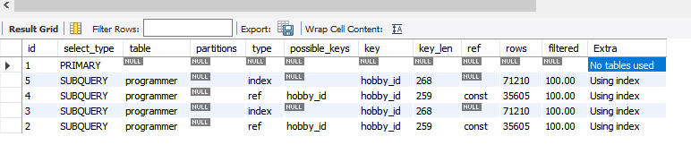

### [2. 프로그래머별로 해당하는 병원 이름을 반환하세요. (covid.id, hospital.name)]
- **결과**
    - [B-2 문제 쿼리 응답](https://github.com/PapimonLikelion/sql-tuning/blob/main/answer/b-2.txt)

- **PK 부터 추가해볼게요**
    - PK가 Unique Key Lookup 이라 더 빠른걸 깜빡했어요. 
    - 모든 인덱스를 폐기하고 PK를 다음과 같이 추가했어요
    ```mysql
    alter table covid add constraint primary key(id);
    alter table programmer add constraint primary key(id);
    alter table hospital add constraint primary key(id);
    ```

- **다음과 같이 쿼리를 작생했어요**
    ```mysql
    select shortenCovid.id AS `covid.id`, hospital.name AS `hospital.name`
    from hospital
        join (select hospital_id, id from covid where programmer_id > 0) AS shortenCovid  
            on hospital.id = shortenCovid.hospital_id;   
    ```

- **다음과 같은 인덱스를 추가했어요**
    ``` mysql
    create index `programmer_id_hospital_id` on covid(`programmer_id`, `hospital_id`);
    ```
    - 실행계획은 다음과 같아요
        - 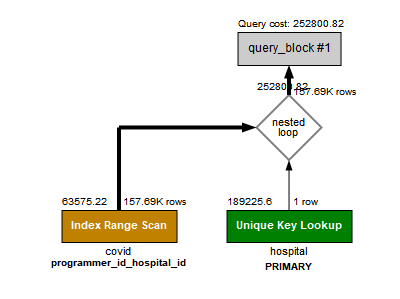 
    - 다음과 같은 결과가 나왔어요. duration_time이 0.000sec에요. 
        - (네트워크와 관련한 fetch time이 100ms 이하로 떨어져야 하는줄 알았답니다ㅜㅜ)
        - 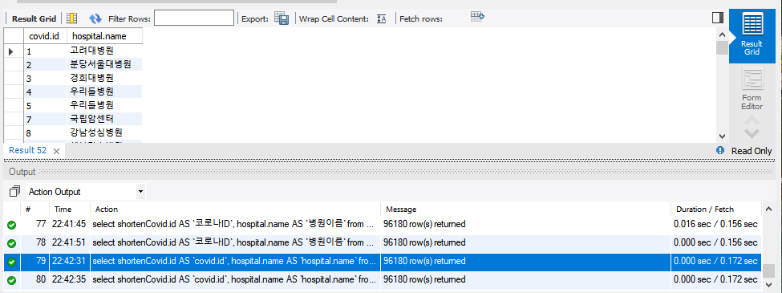   

### [3. 프로그래밍이 취미인 학생 혹은 주니어(0-2년)들이 다닌 병원 이름을 반환하고 user.id 기준으로 정렬하세요. (covid.id, hospital.name, user.Hobby, user.DevType, user.YearsCoding)]
- **결과**
    - [B-3 문제 쿼리 응답](https://github.com/PapimonLikelion/sql-tuning/blob/main/answer/b-3.txt)
    
- **다음과 같이 쿼리를 작성했어요**
    - 앞서 b-2에서 걸어둔 테이블의 pk는 유효해요
    ```mysql    
    select covid.id AS `covid.id`, hospital.name AS `hospital.name`, junior_programmer.hobby AS `user.Hobby`, junior_programmer.dev_type AS `user.DevType`, junior_programmer.years_coding AS `user.YearsCoding`
        from (select id, hobby, dev_type, years_coding
            from programmer
            where (student like "Yes%" and hobby = "Yes") or years_coding = "0-2 years") AS junior_programmer
        join covid
            on junior_programmer.id = covid.programmer_id
        join hospital
            on covid.hospital_id = hospital.id;
    ```
    - 대략 0.016sec 가 소요되어요
        - 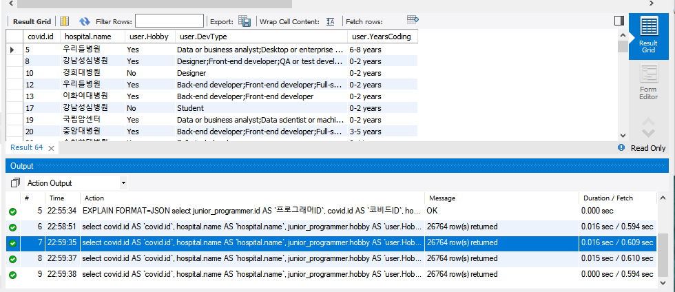
    - 실행 계획은 다음과 같아요
        - 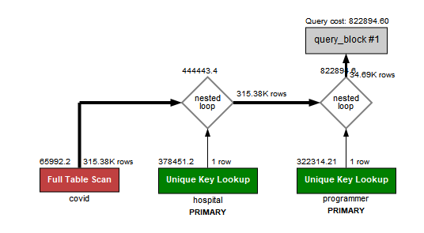
    - 시간이 많이 소요되지 않았다고 판단해, 인덱스는 걸지 않기로 했어요

### [4. 서울대병원에 다닌 20대 India 환자들을 병원에 머문 기간별로 집계하세요. (covid.Stay)]
- **결과**
    - [B-4 문제 쿼리 응답](https://github.com/PapimonLikelion/sql-tuning/blob/main/answer/b-4.txt)
    
- **다음과 같이 쿼리를 작성했어요**
    ```mysql
    select covid.stay, count(*) AS `인원수`
    from programmer 
        join member
            on programmer.member_id = member.id
        join covid
            on programmer.id = covid.programmer_id
        join hospital
            on hospital.id = covid.hospital_id
    where programmer.country = 'India'
        and (member.age >= 20 and member.age < 30)
        and hospital.name = '서울대병원'
    group by stay;
    ```
    - 대략 250ms 정도 소요 되어요
        - 
    - 실행 계획은 다음과 같아요
        - 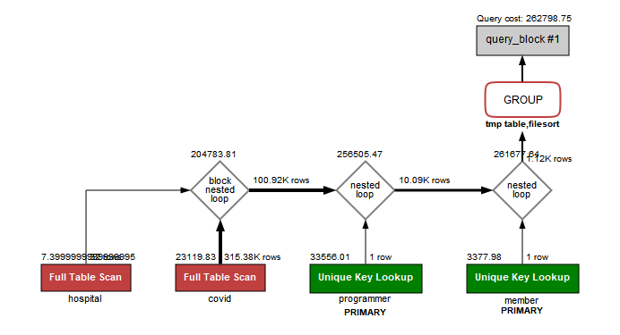

- **다음과 같이 인덱스를 적용했어요**
    - 기존의 programmer, covid, member, hospital에는 id에 PK 조건이 걸려있어요. 
    - covid 테이블에 member_id, programmer_id 에 unique 조건을 걸어줬어요
    - hospital 테이블의 name에 unique를 걸어줬어요
    - programmer 테이블의 member_id에 unique 조건을 걸어줬어요
    - member 테이블에 age에 대해 index를 생성했어요
    - programmer 테이블에 country에 대한 index를 생성했어요
    - 적용 후 대략 95~110ms 정도의 시간이 걸려요
        - 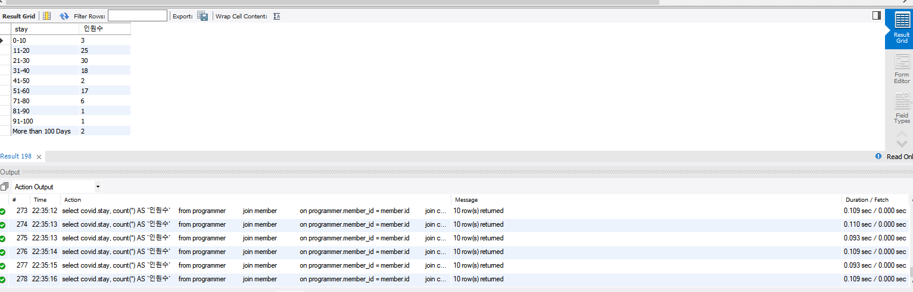
    - 실행 계획은 다음과 같아요
        - 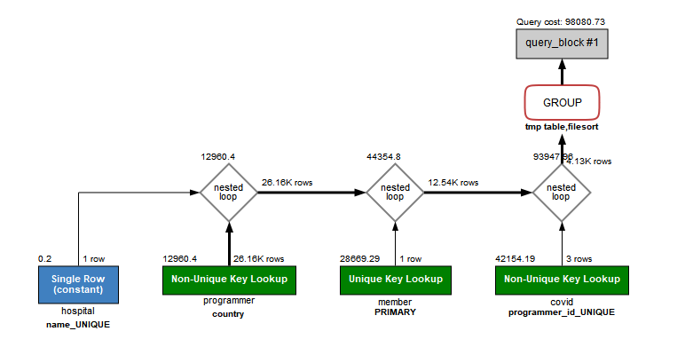    
        
- **더 줄어들지가 않네요...** 
    - stay에 인덱스를 걸어봐도, 
    - where절 대신 각 테이블 별 서브쿼리를 통해 가져오는 필드의 모수를 줄여봐도,
    - 마지막 group by에 tmp table, filesort가 안좋다고 판단해 order by null을 걸어도 (오히려 시간이 늘어나네요ㅜ),
    - 더 이상 시간이 단축되지 않아요ㅜㅜㅜ
    
### [5. 서울대병원에 다닌 30대 환자들을 운동 횟수별로 집계하세요. (user.Exercise)]
- **결과**
    - [B-5 문제 쿼리 응답](https://github.com/PapimonLikelion/sql-tuning/blob/main/answer/b-5.txt)
    
- **다음과 같이 쿼리를 작성했어요**
    ```mysql
    select programmer.exercise, count(member.id)
    from programmer
        join covid
            on programmer.id = covid.programmer_id
        join member
            on programmer.member_id = member.id
        join hospital
            on covid.hospital_id = hospital.id
    where (member.age < 40 and member.age >= 30)
        and hospital.name = '서울대병원'
    group by programmer.exercise
    order by null;
    ```
    - 이미 b-4에서 제약조건을 걸어둔 필드를 많이 재사용을 많이 해서 그런가 약 94ms 정도 소요되었어요. 
        - 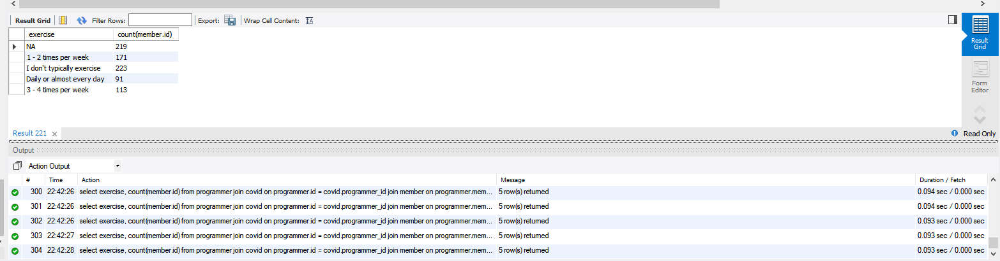
    - 실행계획은 다음과 같아요
        - 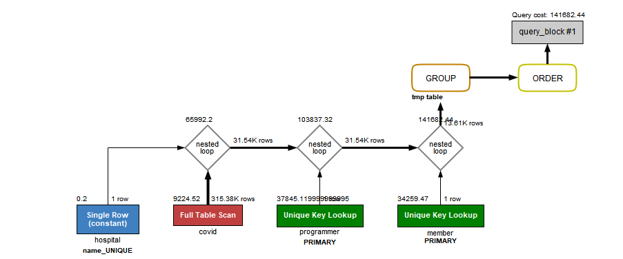    

- **다음과 같은 인덱스를 적용했어요**
    - b-4에서의 제약조건/인덱스는 그대로 사용중이에요
    - covid 테이블에서 full table scan이 발생해요.
        - 따라서 hospital_id에 대해 인덱스를 생성해줬어요. 
    - 약 50ms로 시간이 단축되었어요. 
    - 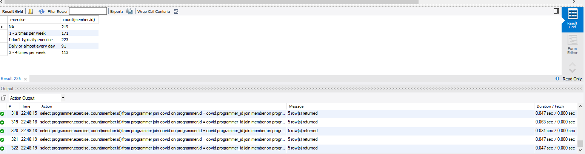
    - 실행계획은 다음과 같아요
        - 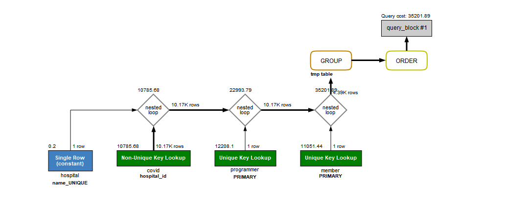
