# A - 쿼리 연습
**활동중인(Active) 부서의 현재 부서관리자 중 연봉 상위 5위안에 드는 사람들이 최근에 각 지역별로 언제 퇴실했는지 조회해보세요.**<br>
**(사원번호, 이름, 연봉, 직급명, 지역, 입출입구분, 입출입시간)**

### 쿼리문
```sql
SELECT
    고연봉관리자.사원번호,
    고연봉관리자.이름,
    고연봉관리자.연봉,
    고연봉관리자.직급명,
    사원출입기록.입출입시간,
    사원출입기록.지역,
    사원출입기록.입출입구분
FROM (
    SELECT
        부서관리자.사원번호,
        사원.이름,
        급여.연봉,
        직급.직급명
    FROM
        부서관리자
            LEFT JOIN 사원 ON 부서관리자.사원번호 = 사원.사원번호
            LEFT JOIN 급여 ON 부서관리자.사원번호 = 급여.사원번호
            LEFT JOIN 직급 ON 부서관리자.사원번호 = 직급.사원번호
            LEFT JOIN 부서 ON 부서관리자.부서번호 = 부서.부서번호
    WHERE
        LOWER(부서.비고) = 'active'
            AND current_date() BETWEEN 부서관리자.시작일자 AND 부서관리자.종료일자
            AND current_date() BETWEEN 급여.시작일자 AND 급여.종료일자
            AND current_date() BETWEEN 직급.시작일자 AND 직급.종료일자
    ORDER BY
        급여.연봉 DESC
    LIMIT
        5
) AS 고연봉관리자
    LEFT JOIN 사원출입기록 ON 고연봉관리자.사원번호 = 사원출입기록.사원번호
WHERE
    사원출입기록.입출입구분 = 'O'
ORDER BY
    고연봉관리자.연봉 DESC;
```

### 실행 계획
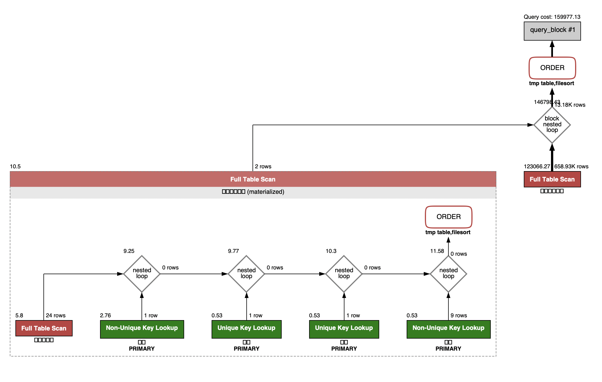

### 실행 결과
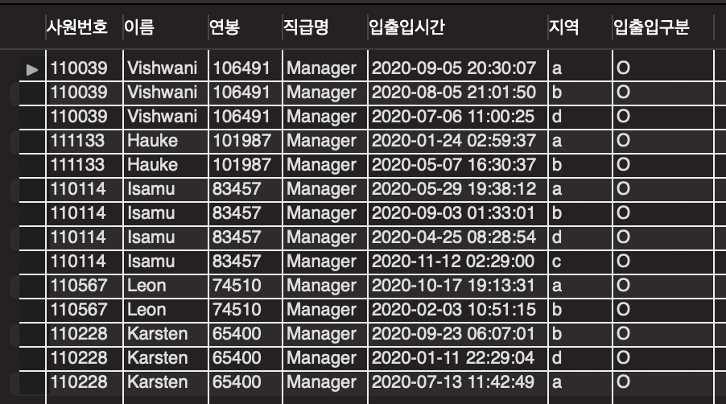
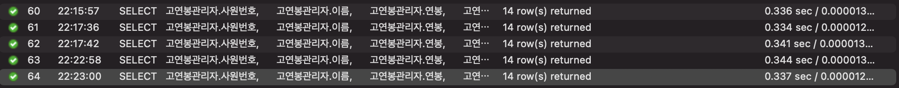

### 변경 사항
* 사원출입기록 - 사원번호 인덱싱

### 변경 후 실행 계획


### 변경 후 실행 결과
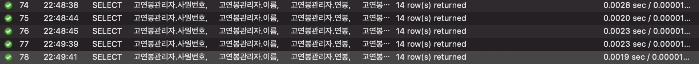

# B - 인덱스 설계

## Coding as a Hobby 와 같은 결과를 반환하세요.

### 쿼리문
```sql
SELECT
    hobby,
    ROUND(
        COUNT(hobby) * 100 / (SELECT COUNT(*) FROM programmer), 1
    ) AS percentage
FROM
    programmer
GROUP BY
    hobby
ORDER BY
    hobby DESC
;
```

### 실행 계획
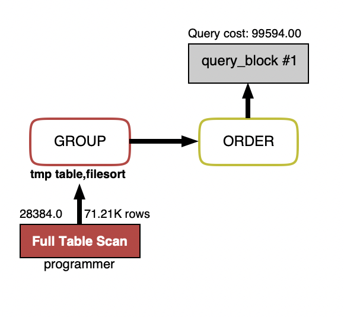

### 실행 결과
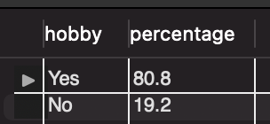
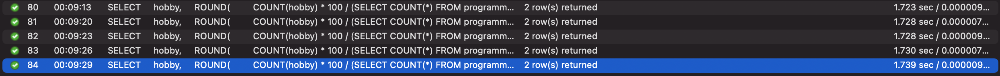

### 변경 사항
* programmer - id PK로 지정
* programmer - hobby 인덱싱

### 변경 후 실행 계획
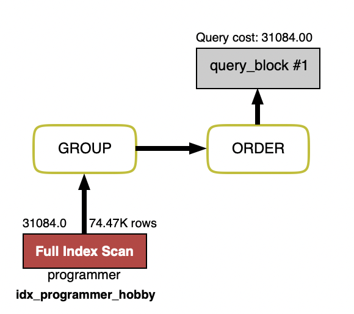

### 변경 후 실행 결과
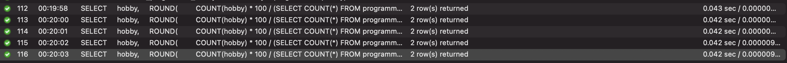

## 프로그래머별로 해당하는 병원 이름을 반환하세요. (programmer.id, hospital.name)

### 쿼리문
```sql
SELECT
    covid.programmer_id as 'programmer ID',
    hospital.name as 'hospital name'
FROM
    covid
        JOIN hospital ON covid.hospital_id = hospital.id
        JOIN programmer ON covid.programmer_id = programmer.id
;
```

### 실행 계획
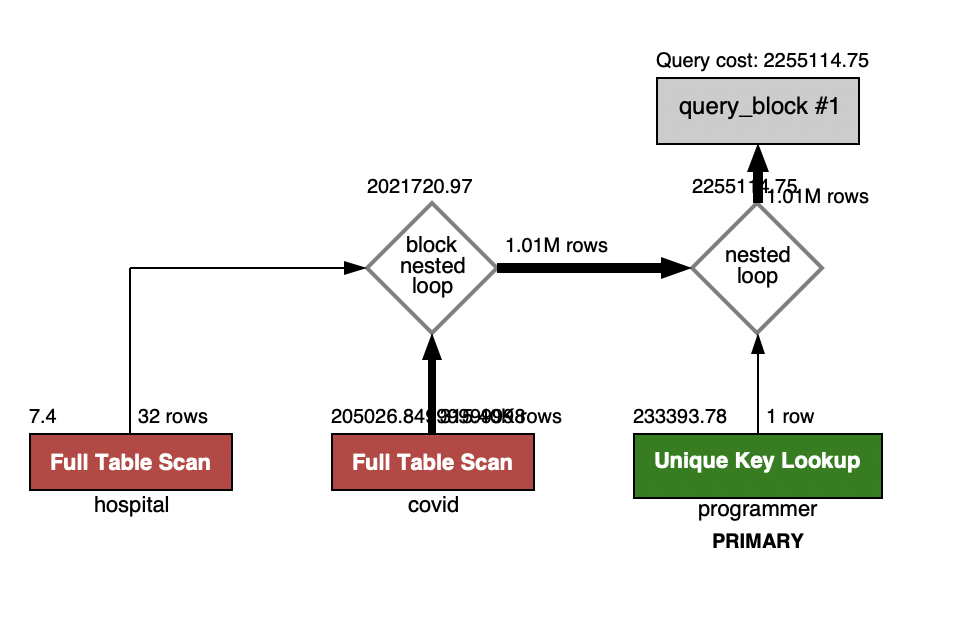

### 실행 결과
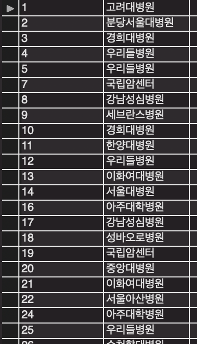
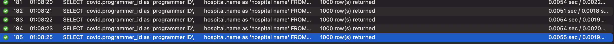

### 변경 사항
* covid - id PK로 지정
* hospital - id PK로 지정

### 변경 후 실행 계획
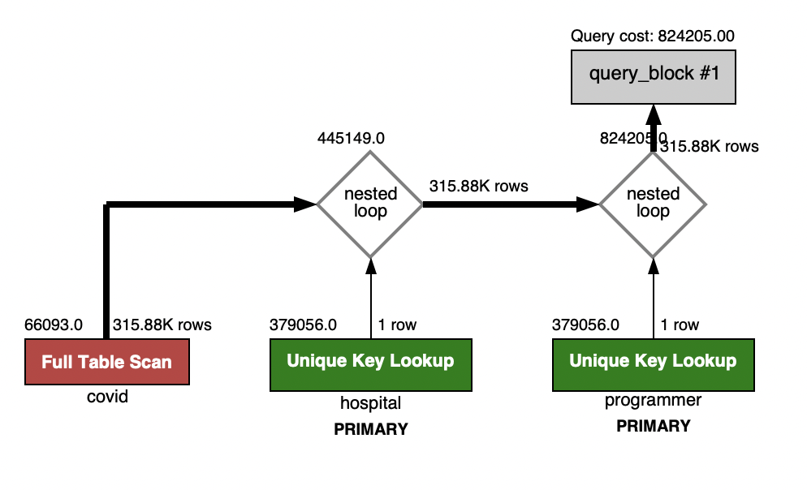

### 변경 후 실행 결과
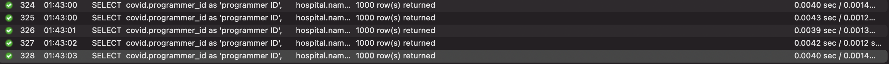

## 프로그래밍이 취미인 학생 혹은 주니어(0-2년)들이 다닌 병원 이름을 반환하고 user.id 기준으로 정렬하세요. 
**(covid.id, hospital.name, user.Hobby, user.DevType, user.YearsCoding)**

### 쿼리문
#### "프로그래밍이 취미인 학생 또는 프로그래밍이 취미인 주니어"로 해석하고 진행했습니다 :)
```sql
SELECT
    programmer.id,
    hospital.name,
    programmer.hobby,
    programmer.dev_type,
    programmer.years_coding
FROM
    covid
        JOIN programmer ON covid.programmer_id = programmer.id
        JOIN hospital ON hospital.id = covid.hospital_id
WHERE
    programmer.hobby = 'Yes'
        AND (
            programmer.student != "No" AND programmer.student != "NA"
            OR programmer.years_coding = '0-2 years'
        )
;
```

### 실행 계획
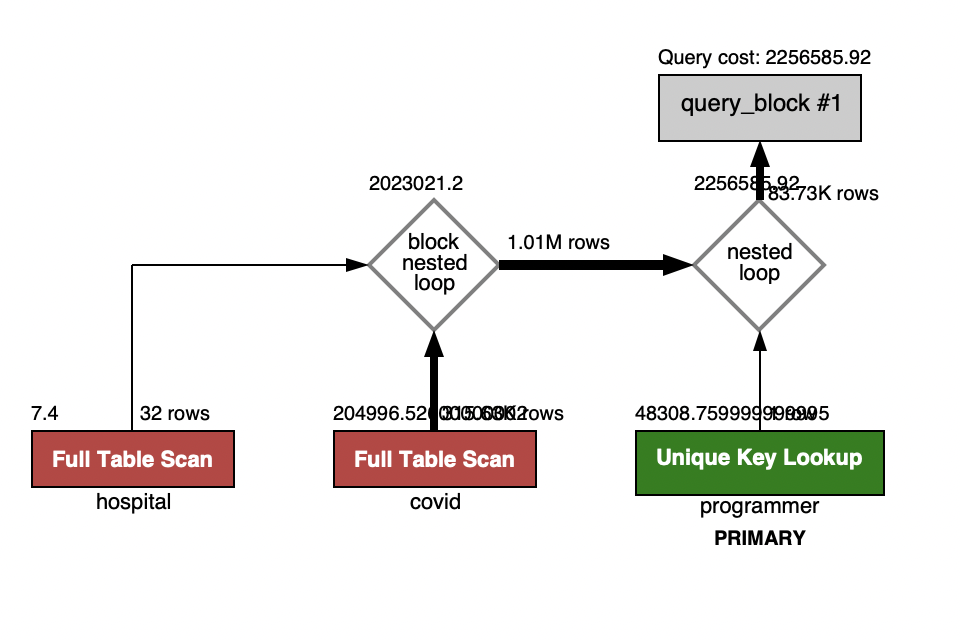

### 실행 결과
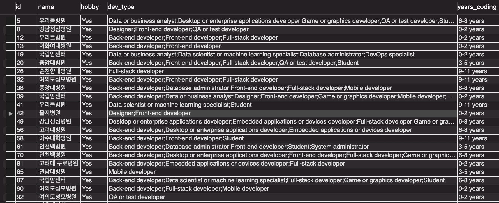
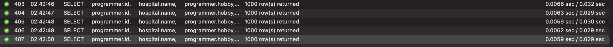

### 변경 사항
* hospital - id PK 적용
* covid - programmer_id 인덱싱
* programmer - hobby 인덱싱
 
### 변경 후 실행 계획
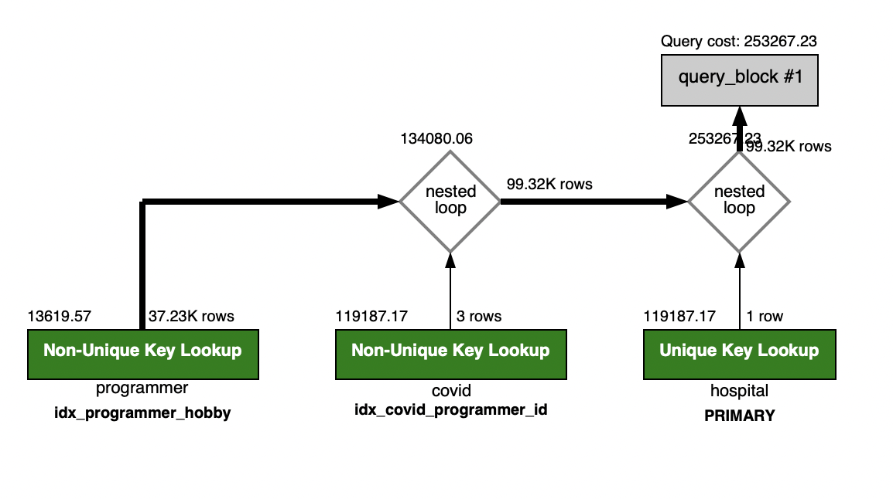

### 변경 후 실행 결과
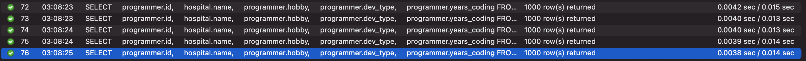

## 서울대병원에 다닌 20대 India 환자들을 병원에 머문 기간별로 집계하세요. (covid.Stay)

### 쿼리문
```sql
SELECT
    covid.stay AS 'duration (days)',
    COUNT(*) AS 'number of patients'
FROM
    covid
        JOIN hospital ON covid.hospital_id = hospital.id
        JOIN member ON covid.member_id = member.id
        JOIN programmer ON covid.programmer_id = programmer.id
WHERE
    hospital.name = '서울대병원'
        AND member.age between 20 AND 29
        AND programmer.country = 'India'
GROUP BY
    covid.stay
;
```

### 실행 계획
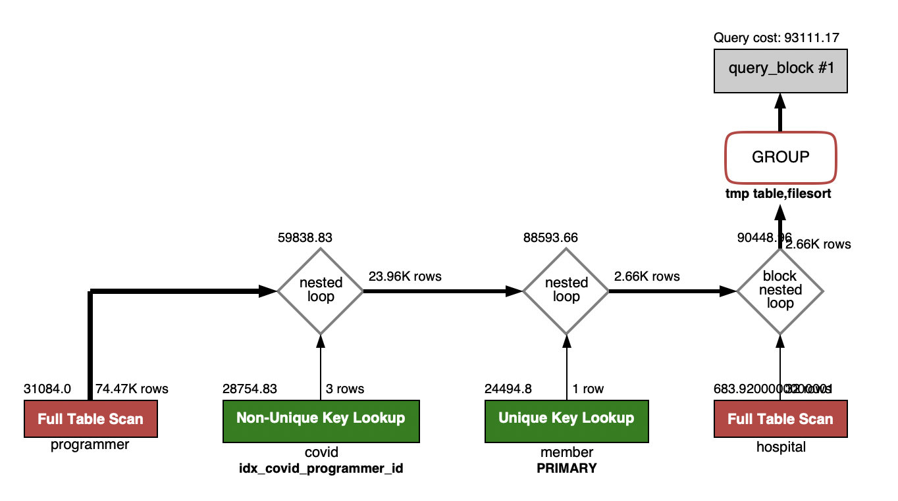

### 실행 결과
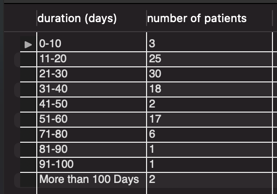
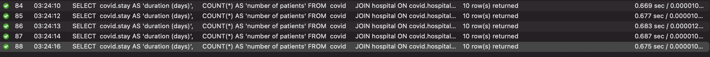

### 변경 사항
* hospital - name unique 설정
* covid - hospital id, member id, programmer id 복합 인덱싱

### 변경 후 실행 계획


### 변경 후 실행 결과
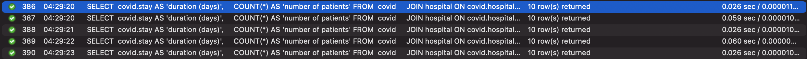

## 서울대병원에 다닌 30대 환자들을 운동 횟수별로 집계하세요. (user.Exercise)

### 쿼리문
```sql
SELECT
    exercise AS 'exercise amount',
        COUNT(*) AS 'count'
FROM
    programmer
        JOIN covid ON programmer.id = covid.id
        JOIN member ON programmer.member_id = member.id
        JOIN hospital ON covid.hospital_id = hospital.id
WHERE
    hospital.name = '서울대병원'
    AND member.age BETWEEN 30 AND 39
GROUP BY
    programmer.exercise
;
```
### 실행 계획
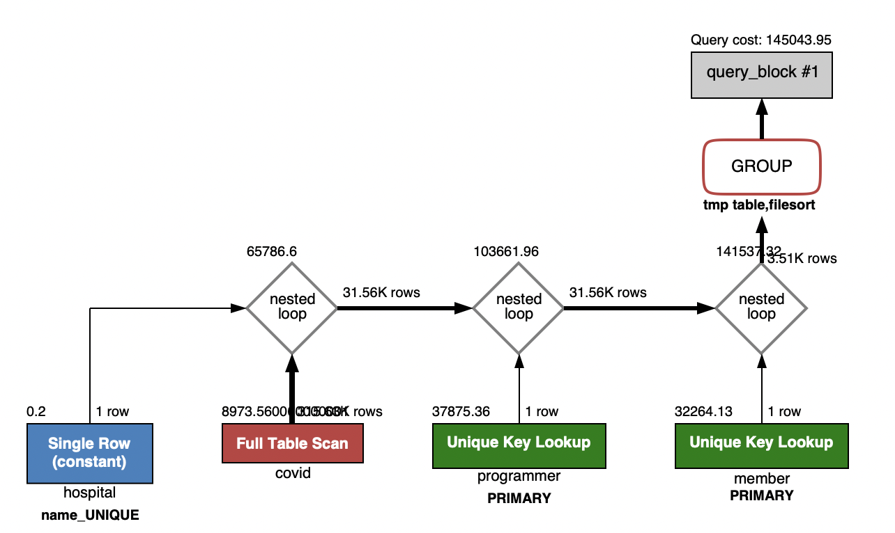

### 실행 결과

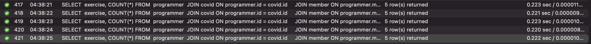

### 변경 사항
* hospital - name unique 설정 (이미 걸려 있었음)
* covid - hospital id, member id, programmer 복합 인덱싱
 
**변경했음에도 불구하고 100ms 이하 기준을 달성하지 못 함.**
* 따라서 쿼리를 다음과 같이 수정함
```sql
SELECT
    exercise AS 'exercise amount',
        COUNT(*) AS 'count'
FROM
    member
        JOIN programmer ON programmer.id = member.id
        JOIN covid ON covid.member_id = programmer.id
        JOIN hospital ON covid.hospital_id = hospital.id
WHERE
    hospital.name = '서울대병원'
        AND member.age BETWEEN 30 AND 39
GROUP BY
    programmer.exercise;
```
### 변경 후 실행 계획

### 변경 후 실행 결과
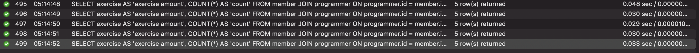
