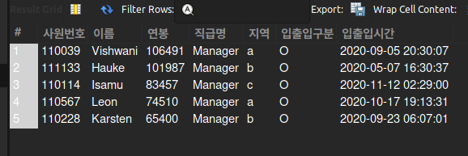
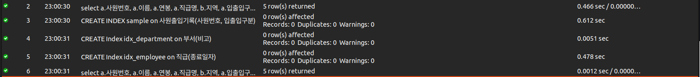

# A. 쿼리 연습

select a.사원번호, a.이름, a.연봉, a.직급명, b.지역, a.입출입구분, a.입출입시간  
from (select e.사원번호 사원번호, e.이름 이름, max(s.연봉) 연봉, max(c.입출입시간) 입출입시간, c.입출입구분, p.직급명 직급명 from 부서관리자 dm   
join 부서 as d on d.부서번호 = dm.부서번호  
join 사원 as e on e.사원번호 = dm.사원번호  
join 직급 as p on p.사원번호 = e.사원번호  
join 급여 as s on s.사원번호 = e.사원번호  
join 사원출입기록 as c on e.사원번호 = c.사원번호  
where d.비고 = "active" and dm.종료일자 = "9999-01-01" and p.종료일자 = "9999-01-01" and c.입출입구분 = "O" group by 사원번호, 직급명) a  
JOIN 사원출입기록 as b on a.사원번호 = b.사원번호 and a.입출입시간 = b.입출입시간 order by 연봉 desc limit 5;  
  
인덱스  
  
CREATE INDEX sample on 사원출입기록(사원번호, 입출입구분);  
CREATE Index idx_department on 부서(비고);  
CREATE Index idx_employee on 직급(종료일자);  

실행결과  
  
  
 
 

