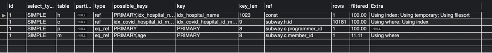
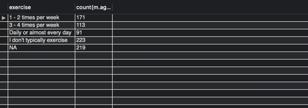
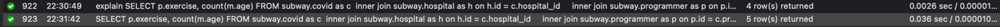

# 🚀 조회 성능 개선하기

## A. 쿼리 연습

### 1. 활동중인(Active) 부서의 현재 부서관리자 중 연봉 상위 5위안에 드는 사람들이 최근에 각 지역별로 언제 퇴실했는지 조회해보세요. (사원번호, 이름, 연봉, 직급명, 지역, 입출입구분, 입출입시간)
+ 쿼리
```
select e.사원번호, f.이름, f.연봉, f.직급명, e.지역, e.입출입시간, e.입출입구분 from 사원출입기록 as e inner join 
	(select m.사원번호, w.이름, j.직급명, p.연봉 from 부서 as t
		inner join 부서관리자 as m on t.부서번호 = m.부서번호
		inner join 직급 as j on m.사원번호 = j.사원번호    
		inner join 급여 as p on p.사원번호 = m.사원번호
		inner join 사원 as w on w.사원번호 = m.사원번호
			where t.비고 = 'active' and j.직급명 = 'manager' and p.종료일자 > NOW() and m.종료일자 > NOW()
				order by 연봉 desc limit 5) as f 
	on e.사원번호 = f.사원번호
		where e.입출입구분 = 'O'	
			order by f.연봉 desc, e.입출입시간;
```
+ 실행 조건
  + (사원출입기록.사원번호) 인덱스 추가
+ 실행 계획
  
+ 실행 결과 / 성능
  <br>
  
  <br>
  

## B. 인덱스 설계
### Coding as a Hobby 와 같은 결과를 반환하세요.
+ 쿼리
```
select (select count(*) from programmer where hobby = 'yes')/count(*) * 100 as yes,
	(select count(*) from programmer where hobby = 'no')/count(*) * 100 as no from programmer
```
+ 실행 조건
  + (programmer.hobby) 인덱스
+ 실행 계획
  
+ 실행 결과 / 성능
  <br>
  
  <br>
  
  
### 프로그래머 별로 해당하는 병원
+ 쿼리
```
SELECT c.programmer_id, h.name FROM subway.covid as c
    inner join subway.hospital as h on c.hospital_id = h.id
    inner join subway.programmer as p on c.programmer_id = p.id;
```
+ 실행 조건
  + (covid.hospital_id) 인덱스
+ 실행 계획
  
+ 실행 결과 / 성능
  <br>
  
  <br>
  
  
### 프로그래밍이 취미인 학생 혹은 주니어(0-2년)들이 다닌 병원 이름을 반환하고 user.id 기준으로 정렬하세요. (covid.id, hospital.name, user.Hobby, user.DevType, user.YearsCoding)
+ 쿼리
```
SELECT c.id, h.name, p.hobby, p.dev_type, p.years_coding FROM covid as c
	inner join programmer as p on c.programmer_id = p.id
	inner join hospital as h on h.id = c.hospital_id		
		where p.hobby = 'yes' and p.student like 'yes%' or p.years_coding = '0-2 years';
```
+ 실행 조건
  + (covid.hospital_id, programmer_id) 인덱스
  + (hospital.name) 인덱스
+ 실행 계획
  
+ 실행 결과 / 성능
  <br>
  
  <br>
  
  
### 서울대병원에 다닌 20대 India 환자들을 병원에 머문 기간별로 집계하세요. (covid.Stay)
+ 쿼리
```
select c.stay, count(*) FROM subway.covid as c
	inner join subway.hospital as h on h.id = c.hospital_id
    inner join subway.programmer as p on p.id = c.programmer_id
    inner join subway.member as m on m.id = c.member_id
		where h.name = '서울대병원' and p.country = 'india' and m.age like '2%'
	group by c.stay;
```
+ 실행 조건
  + (covid.hospital_id, programmer_id, member_id) 인덱스
  + (hospital.name) 인덱스
  + (member.age) 인덱스
  + (programmer.country) 인덱스
+ 실행 계획
  
+ 실행 결과 / 성능
  <br>
  
  <br>
  

### 서울대병원에 다닌 30대 환자들을 운동 횟수별로 집계하세요
+ 쿼리
```
SELECT p.exercise, count(m.age) FROM subway.covid as c
	inner join subway.hospital as h on h.id = c.hospital_id
    inner join subway.programmer as p on p.id = c.programmer_id
    inner join subway.member as m on m.id = c.member_id
		where h.name = '서울대병원' and m.age like '3%'
			group by p.exercise;
```
+ 실행 조건
  + (covid.hospital_id, programmer_id, member_id) 인덱스
  + (hospital.name) 인덱스
  + (member.age) 인덱스
+ 실행 계획
  
+ 실행 결과 / 성능
  <br>
  
  <br>
  

