# 🚀 조회 성능 개선하기

<br>

# A. 

> 활동중인(Active) 부서의 현재 부서관리자 중 연봉 상위 5위안에 드는 사람들이 최근에 각 지역별로 언제 퇴실했는지 조회해보세요.
> (사원번호, 이름, 연봉, 직급명, 지역, 입출입구분, 입출입시간)

<br>

### 1. 쿼리 작성만으로 1s 이하로 반환한다.

```sql
SELECT 활동중인_부서관리자.사원번호, 이름, 연봉, 직급명, 입출입시간, 지역, 입출입구분
	FROM (
		SELECT 사원.사원번호, 사원.이름, 급여.연봉, 직급.직급명
			FROM 부서
			LEFT JOIN 부서관리자 ON 부서관리자.부서번호 = 부서.부서번호
			LEFT JOIN 사원 ON 사원.사원번호 = 부서관리자.사원번호
			LEFT JOIN 직급 ON 직급.사원번호 = 부서관리자.사원번호
			LEFT JOIN 급여 ON 급여.사원번호 = 부서관리자.사원번호
			WHERE 부서.비고='active' AND 부서관리자.종료일자 > NOW() AND 급여.종료일자 > NOW() AND 직급.종료일자 > NOW()
			ORDER BY 급여.연봉 DESC
			LIMIT 5
		) 활동중인_부서관리자
	LEFT JOIN 사원출입기록 ON 사원출입기록.사원번호 = 활동중인_부서관리자.사원번호
    WHERE 사원출입기록.입출입구분='o'
    ORDER BY 활동중인_부서관리자.연봉 DESC, 지역;
```

<details>
  <summary>쿼리 결과 보기</summary>
  <p align="center">
  	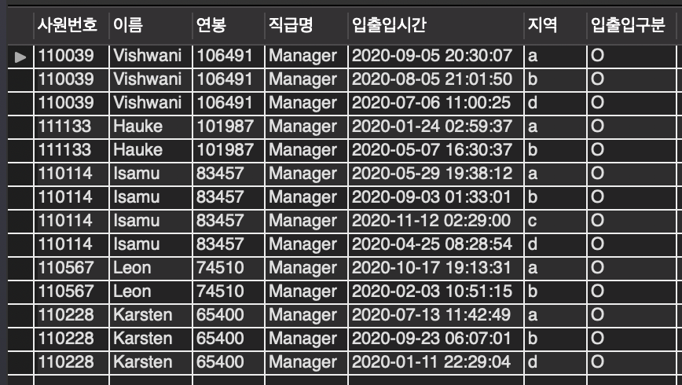
	요구사항에 있는 결과와 동일
</details>

<details>
  <summary>수행 시간 보기</summary>
  <p align="center">
    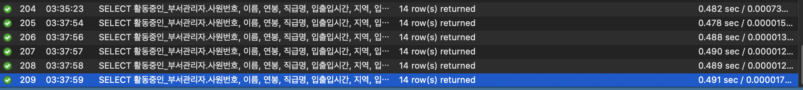
  </p>
  1s 이하
</details>
<br>

### 2. 인덱스 설정을 추가하여 50ms 이하로 반환한다.

<details>
<summary>개선 대상 파악</summary>
<p align="center">
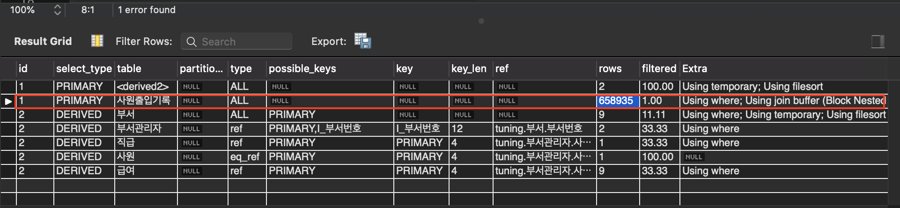
</p> 
쿼리 성능 저하의 가장 큰 원인은 `사원출입기록` 테이블을 조인할 시, 테이플 풀 스캔하기 때문.
</details>
<details>
  <summary>인덱스 추가</summary>
  <ul>
      <li><code>CREATE INDEX `idx_사원번호` ON `사원출입기록` (사원번호)</code></li>
  </ul>
</details>


<details>
  <summary>개선 결과</summary>
  <p align="center">
    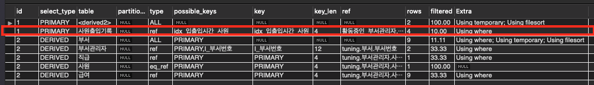
  <p align="center">
  	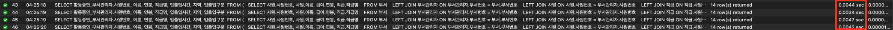
  요구사항인 50 ms보다 적게 걸리는 것을 볼 수 있다.
</details>
<br>

# B. 인덱스 설계

> 주어진 데이터셋을 활용하여 아래 조회 결과를 100ms 이하로 반환

<br>

### [Coding as a Hobby]()와 같은 결과를 반환하세요

```sql
SELECT hobby, ROUND(COUNT(hobby) / (SELECT COUNT(*) FROM programmer) * 100, 1) as percent
	FROM programmer
    GROUP BY hobby;
```

<p align="center">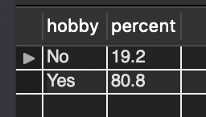<br>결과</p>

<details>
  <summary>개선 대상 파악</summary>
  <p align="center">
    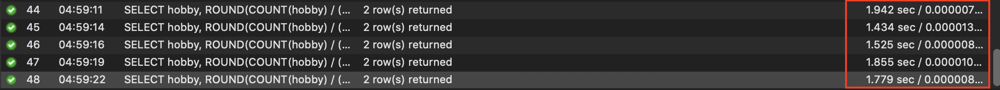
보시다싶이 성능이 좋지 않다. (요구사항 만족 불가)<br>
그 이유는 테이플 풀 스캔이 발생하기 때문이라 판단.<br>
  <p align="center">
    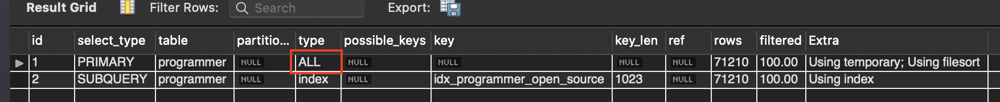
</details>
<details>
  <summary>인덱스 추가</summary>
  <ul>
    <li>hobby 컬럼에 대한 인덱싱 추가 + programmer 테이블 id를 PK로 설정</li>
    <li><code>CREATE INDEX `idx_hobby` ON `programmer` (hobby);</code></li>
  </ul>
</details>


<details>
  <summary>개선 결과</summary>
  <p align="center">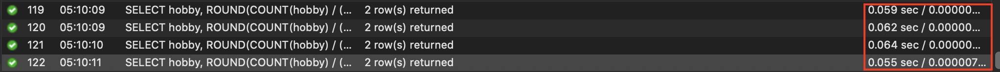</p>
  <br>
  100ms보다 적은 시간이 소요되므로 성공.<br><br>
  <p align="center">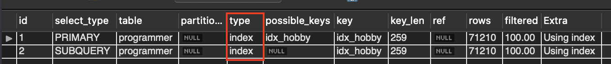</p>
  <br>
  테이블 풀 스캔이 인덱스 풀 스캔으로 변경된 것을 볼 수 있다.
</details>
<br>

### 프로그래머별로 해당하는 병원 이름을 반환하세요

> covid.id, hospital.name

```sql
SELECT covid.id AS covid_id , hospital.name AS hospital_name
	FROM hospital
    LEFT JOIN covid ON covid.hospital_id = hospital.id
    LEFT JOIN programmer ON programmer.id = covid.programmer_id;
```

<p align="center">
  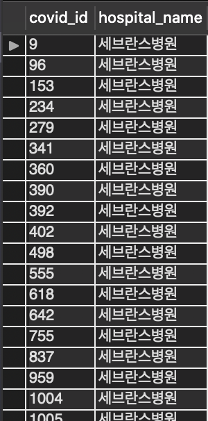<br>결과
</p>


<details>
	<summary>쿼리 상세 내용</summary>
	쿼리에서 왜 저렇게 JOIN을 구성했을까? 바로 드라이브 테이블, 드리븐 테이블 개념때문이다.
	<br><br>
  각 테이블별로 row 개수를 파악해보니, hospital -> programmer -> covid 순으로 많다.
  <br><br>
  hospital은 로우가 32개밖에 안되므로, hospital을 테이블 풀 스캔하고 나머지를 인덱스를 걸어 JOIN하려고 함.
</details>


<details>
  <summary>개선 대상 파악</summary>
  <p align="center">
    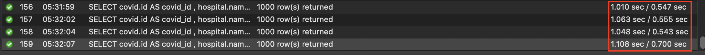
  </p>
  <br>
  성능이 굉장히 좋지 않음.<br><br>
  <p align="center">
    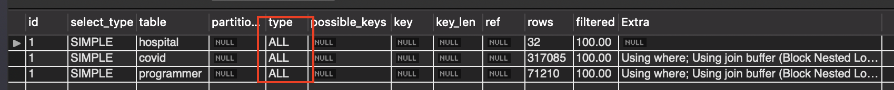
  </p>
  <br>
  실행 계획을 보니 join 작업 모두 테이블 풀 스캔을 하고 있다.
  <br><br>
  인덱싱을 통해 문제 해결해야함.
</details>

<details>
  <summary>첫 번째 개선 - programmer 테이블 PK 설정</summary>
  우선은 covid -> programmer join로 인한 programmer 테이블 풀 스캔 문제를 해결하기로 계획함.
  <br><br>
  그래서 programmer.id에 PK값 설정
  <br><br>
  나머지 두 테이블에도 id에 PK값 설정해줌
  <br>
  (현재는 큰 의미 없지만, 그래도 PK의미를 가진 컬럼이라 생각들어 설정해줌)
  <br>
</details>

<details>
  <summary>첫 번째 개선 결과</summary>
  <br>
    <p align="center">
    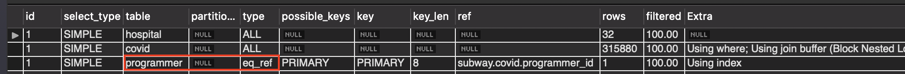<br><br>
  programmer 테이블을 탐색할 때 테이블 풀 스캔 없이, 인덱싱을 통해 바로 가져오는 것을 볼 수 있음 (뿌듯)
  <br><br>
  <p align="center">
    <br><br>
  오! 확실히 로우 개수가 비교적 많은 programmer의 테이블 풀 스캔을 인덱스로 해결하니 결과가 훨씬 좋아짐.    
</details>
<details>
  <summary>두 번째 개선 - covid 테이블 hospital 인덱스 추가</summary>
  <br>
  hospital -> covid join할 때 covid에서 테이블 풀 스캔 문제 발생하는 것도 해결하기로 계획함.
  <br><br>
  그래서 covid.hospital_id에 인덱스 추가 해줌
  <br><br>
  <code>CREATE INDEX `idx_hospital_id` ON `covid` (hospital_id);</code>
  <br><br>
</details>

<details>
  <summary>두 번째 개선 결과</summary>
  <br>
  <p align="center">
    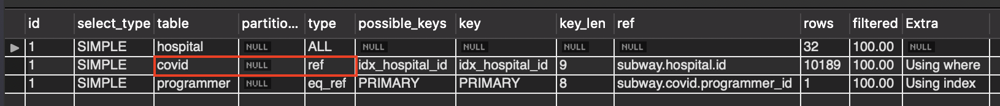<br><br>
  covid도 테이블 풀 스캔이 아닌 인덱싱을 통해 랜덤 I/O로 데이터를 가져온다 (뿌듯)
  <br><br>
  <p align="center">
    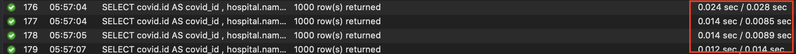<br><br>
  이미 성능이 좋았음으로, 성능상에 비약적인 개선은 없지만, 평균 값이 훨씬 낮아졌다.
</details>

<br>

### 프로그래밍이 취미인 학생 혹은 주니머(0-2년)들이 다닌 병원 이름을 반환하고 user.id 기준으로 정렬하세요. 

> covid.id, hospital.name, user.Hobby, user.DevType, user.YearsCoding

```sql
EXPLAIN
SELECT covid.id, hospital.name, user.Hobby, user.dev_type, user.years_coding
	FROM hospital
    LEFT JOIN covid ON covid.hospital_id = hospital.id
    LEFT JOIN programmer AS user ON user.id = covid.programmer_id
    WHERE 
		(user.hobby = 'Yes' AND user.student <> 'No' AND user.student <> 'NA')
        OR
        user.years_coding = '0-2 years';
```

<p align="center">
  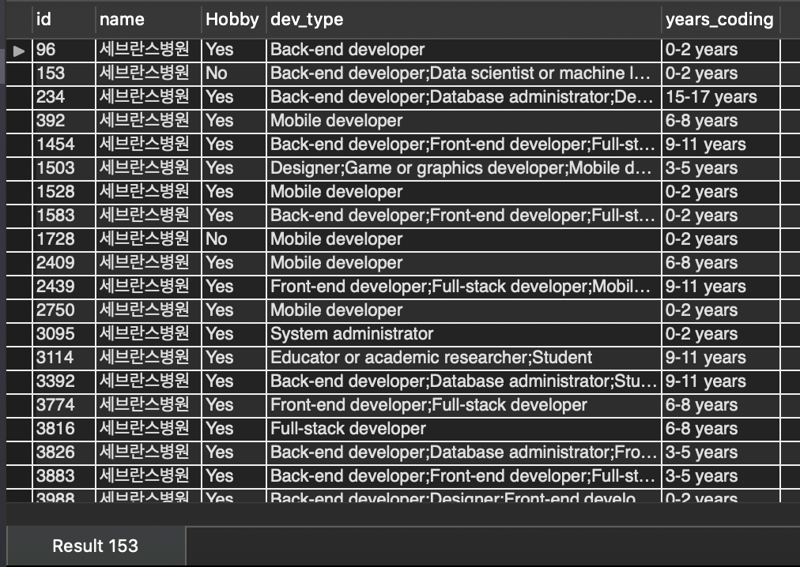<br>결과
</p>

<details>
  <summary>개선 대상 파악</summary>
  위에서 이미 PK 설정과 인덱스 설정을 다 해줬으므로, 따로 해줄 것은 없었음.
</details>

<details>
  <summary>결과</summary>
  <p align="center">
    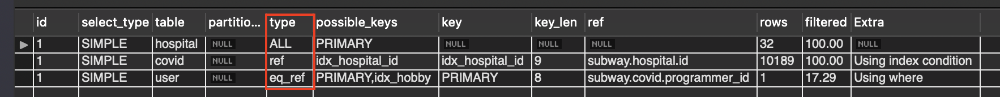
  </p><br><br>
  바로 윗 문제에서 인덱스 설정을 다 해줘서 크게 해줄 것은 없었다.
  <br><br>
  쿼리의 JOIN 순서도 최대한 조회를 적게 하도록 작성해서, 로우 개수가 가장 적은 hospital만 테이블 풀 스캔이 발생하는 것을 볼 수 있음.<br><br>
  <p align="center">
    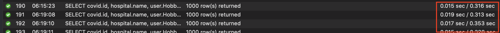
  </p><br><br>
  결과도 좋다!
</details>

<br>

### 서울대병원에 다닌 20대 India 환자들을 병원에 머문 기간별로 집계하세요.

> 인덱스가 꼬여서 도커 다시 켜서 작성함.

> covid.stay

```sql
SELECT stay, COUNT(stay)
	FROM (
		SELECT id
			FROM member
			INNER JOIN (SELECT member_id FROM programmer WHERE country = 'India') AS P ON P.member_id = id
			WHERE age BETWEEN 20 AND 29
		) AS M
	INNER JOIN (SELECT member_id, hospital_id, stay FROM covid) AS C ON C.member_id = M.id
	INNER JOIN (SELECT id FROM hospital WHERE name = '서울대병원') AS H ON H.id = C.hospital_id
	GROUP BY stay ORDER BY NULL;
```

<p align="center">
  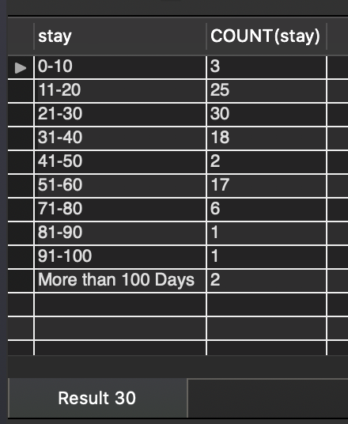<br>결과
</p>

<details>
  <summary>개선 대상 파악 및 인덱스 설정</summary>
  개선 대상은 사실 전체. 하나하나 테스트하였고, 최대한 인덱스를 이용하도록 작성함.
  <br><br>
  <ul>
    <li><code>hospital.name</code> varchar 수정 후 <code>id</code> PK로 설정 및 <code>name</code>인덱스 (unique)설정</li>
    <li><code>covid.hospital_id</code>인덱스 설정</li>
    <li><code>programmer.member_id</code>인덱스 설정</li>
    <li><code>member.age</code>인덱스 설정</li>
</ul>
</details>

<details>
  <summary>결과</summary>
  <p align="center">
    
  </p>
  <br><br>
  <p align="center">
    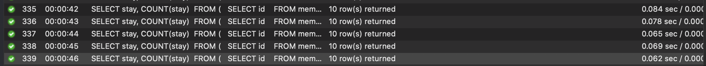
  </p>
</details>

<br>

### 서울대병원에 다닌 30대 환자들을 운동 횟수별로 집계하세요.

> 인덱스가 꼬여서 도커 다시 켜서 작성함.

> user.Exercise

```sql
SELECT exercise, COUNT(*)
	FROM (
		SELECT id, exercise
			FROM member
            INNER JOIN (SELECT member_id, exercise FROM programmer) AS P ON P.member_id = id
            WHERE age BETWEEN 30 AND 39
		) AS M
	INNER JOIN (SELECT member_id, hospital_id FROM covid) AS C ON C.member_id = M.id
    INNER JOIN (SELECT id FROM hospital WHERE name = '서울대병원') AS H ON H.id = C.hospital_id
    GROUP BY exercise ORDER BY null;
```

<p align="center">
  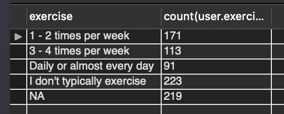<br>결과
</p>

<details>
  <summary>개선 대상 파악 및 인덱스 설정</summary>
  <br><br>
  <ul>
    <li><code>hospital.name</code> varchar 수정 후 <code>id</code> PK로 설정 및 <code>name</code>인덱스 (unique)설정</li>
    <li><code>covid.hospital_id</code>인덱스 설정</li>
    <li><code>programmer.member_id</code>인덱스 설정</li>
    <li><code>member.age</code>인덱스 설정</li>
</ul>
</details>

<details>
  <summary>결과</summary>
  <p align="center">
    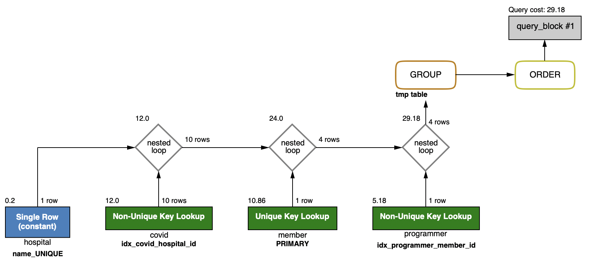
  </p>
  <br><br>
  <p align="center">
    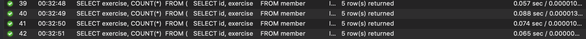
  </p>
</details>

