## Q. Coding as a Hobby 와 같은 결과를 반환하세요.

#### - 쿼리
```sql
select hobby, round(count / total * 100, 1) as ratio
from
(
	select hobby, count(*) as count
	from programmer 
	group by hobby
)tbl_count,
(
	select count(*) as total
    from programmer
)tbl_total
order by hobby desc;
```
#### - 결과
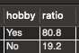 <br>

#### - 성능 개선 전
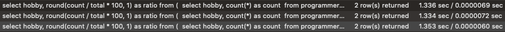 <br>
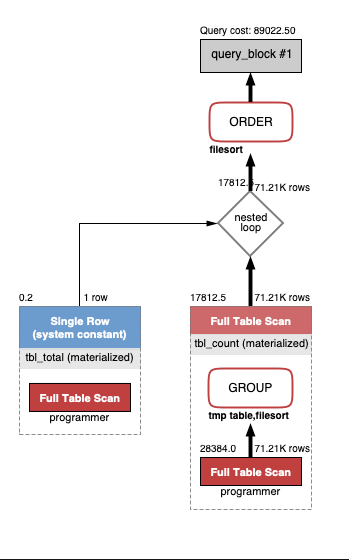 <br>
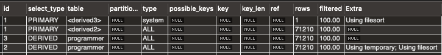 <br>

#### - 성능 개선
```sql
alter table `programmer` add primary key(id);
create index `index_hobby`  on `subway`.`programmer` (hobby)
```
#### - 성능 개선 후
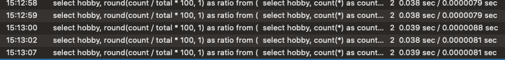 <br>
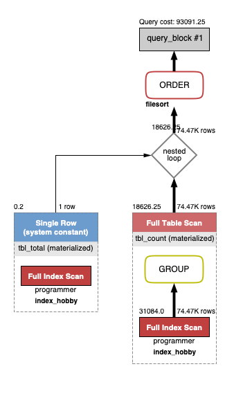 <br>
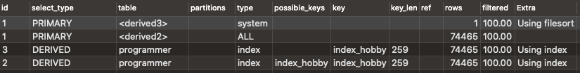 <br>

#### - 의문
```
explain 에서 쿼리 코스트가 오히려 올라갔는데, 속도는 압도적으로 빨라짐 
``` 

<br><br>

## Q. 프로그래머별로 해당하는 병원 이름을 반환하세요. (covid.id, hospital.name)
### covid.id 대신 programmer.id 라고 생각 

#### - 쿼리
```sql
select covid.programmer_id as programmerId, hospital.name as hospitalName
from covid
join hospital
on hospital_id = hospital.id and covid.programmer_id is not null 
```

#### - 성능 개선 전
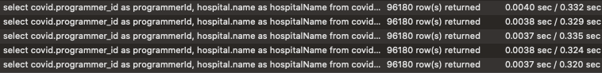 <br>
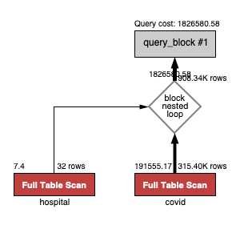 <br>
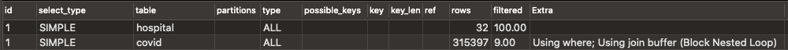<br>

#### - 성능 개선
```sql
alter table `covid` add primary key(id);
alter table `hospital` add primary key(id);
create index `index_hospital_id_programmer_id`  on `subway`.`covid` (hospital_id, programmer_id)
```

#### - 성능 개선 후
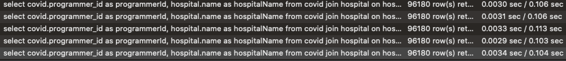 <br>
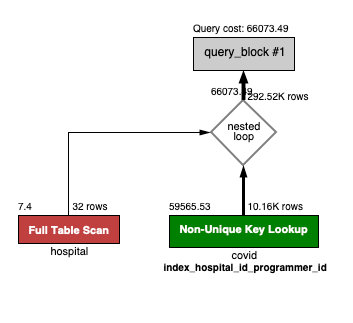 <br>
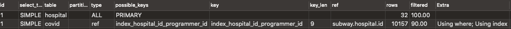 <br>

#### - 의문
- Fetch Time은 왜 쿼리마다 달리지는 걸까?
- is not null 사용 안 하고 join 한다고 장점이 있을까?
- 실행 계획을 보면 엄청 느려야 할 것 같은데, 왜 처음부터 빠르지?

<br><br>

## Q. 프로그래밍이 취미인 학생 혹은 주니어(0-2년)들이 다닌 병원 이름을 반환하고 user.id 기준으로 정렬하세요. 
### (covid.id, hospital.name, user.Hobby, user.DevType, user.YearsCoding)

#### - 쿼리
```sql
select covid.id, hospital.name, user.hobby, user.dev_type, user.years_coding
from
(
    select id, hobby, dev_type, years_coding 
    from programmer
    where (student like 'yes%' or years_coding = '0-2 years') and hobby = 'yes'
)user
join covid
on user.id = covid.programmer_id
join hospital 
on covid.hospital_id = hospital.id
order by user.id
```

#### - 인덱스 적용
여기서 부터는 Workbench를 사용하여 편하게 마우스로 인덱스 넣음.
```
covid 테이블에 programmer_id 인덱스 추가
```
programmer index <br>
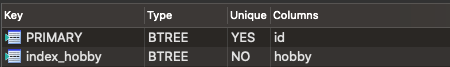 <br>
covid index <br>
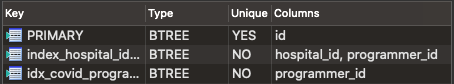 <br>
hospital index <br>
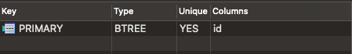 <br>

#### - 결과
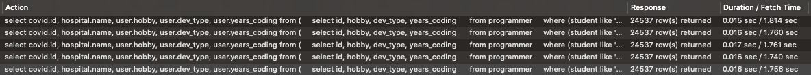 <br>
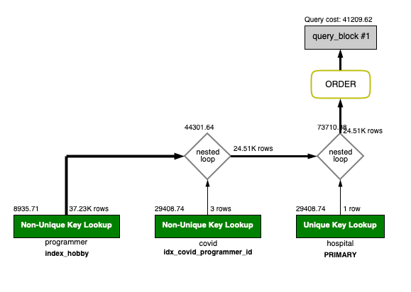 <br>
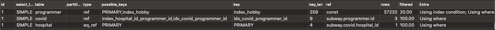 <br>

<br><br>

## Q. 서울대병원에 다닌 20대 India 환자들을 병원에 머문 기간별로 집계하세요. (covid.Stay)

#### - 쿼리
```sql
select seoul_univ.stay, count(*)
from
(
	select covid.stay, covid.programmer_id, covid.member_id
	from covid
	where hospital_id in (select id from hospital where name = '서울대병원')
)seoul_univ
join programmer
on seoul_univ.programmer_id =  programmer.id and programmer.country = 'india'
join member
on seoul_univ.member_id = member.id and member.age between 20 and 29
group by seoul_univ.stay
```

#### - 개선 전
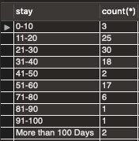 <br>
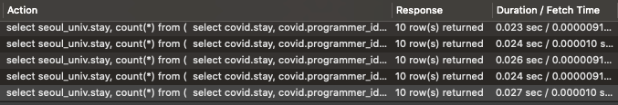 <br>
 <br>
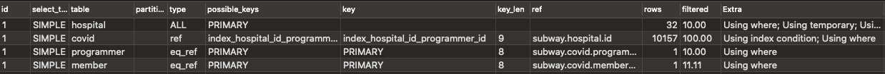 <br>

#### - 이상한 점
시간으로 성능 측정하면 안 될 것 같음.
같은 쿼리를 실행 시켰는데 성능이 줄어드는 상황이 발생하였음
이제까지 시간으로 성능을 측정하던 것이 문제가 있다는 생각이 듬..
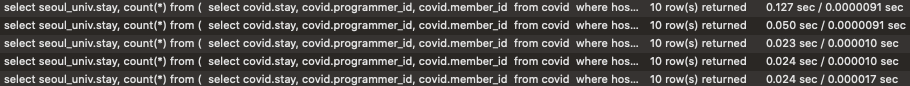

#### - 개선
- 씨유 수업을 다시 보고 hospital name을 수정함
- order by null을 넣어봤는데, 최종 결과의 정렬이 안 되어서 뺌
```sql
hospital 테이블: name text -> varchar(255)로 수정, unique 추가 (UNIQUE 인덱스 자동 생성)
member 테이블: age 컬럼 index 추가
programmer 테이블: country 컬럼 index 추가
```

#### - 개선 후
explain 테이블의 key를 보면 개선 전이나 후나 PRIMARY 라고 나와있어서 
age와 country에 인덱스를 건 게 효과가 없나?
라고 생각해서 빼보니까 filter의 숫자가 달라지는 것을 확인하고 뭔가 적용이 된다고 생각했음.<br>
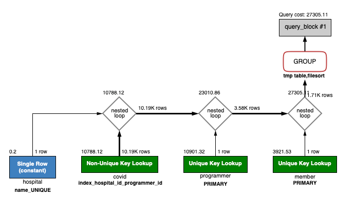 <br>
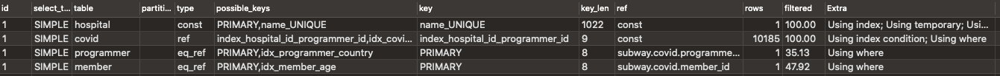 <br>

<br><br>

## Q. 서울대병원에 다닌 30대 환자들을 운동 횟수별로 집계하세요. (user.Exercise)

#### - 쿼리
```sql
select programmer.exercise, count(*)
from
(
	select covid.programmer_id, covid.member_id
	from covid
	where hospital_id in (select id from hospital where name = '서울대병원')
)seoul_univ
join member
on seoul_univ.member_id = member.id and member.age between 30 and 39
join programmer
on seoul_univ.programmer_id =  programmer.id
group by programmer.exercise
order by null;
```

#### - 개선 전
 <br>
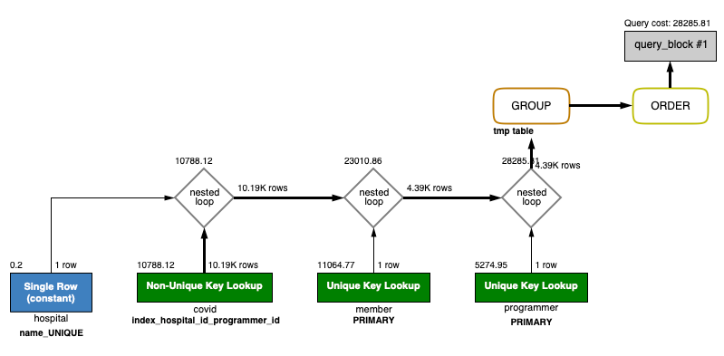 <br>
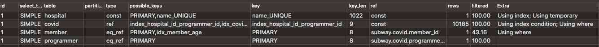 <br>

#### - 개선
```
programmer 테이블: exercise 컬럼 VARCHAR(255) 로 수정하고 인덱스 추가
```

#### - 개선 후
계획상으로는 개선 전과 달라진 부분이 없음
