# A. 쿼리 연습

- [x] 활동중인(Active) 부서의 현재 부서관리자 중 연봉 상위 5위안에 드는 사람들이 최근에 각 지역별로 언제 퇴실했는지 조회해보세요.
(사원번호, 이름, 연봉, 직급명, 지역, 입출입구분, 입출입시간)

1. 쿼리 작성만으로 1s 이하로 반환한다.

__쿼리문__

```sql
select 부서관리자_급여.사원번호, 부서관리자_급여.이름, 부서관리자_급여.연봉, 부서관리자_급여.직급명, 사원출입기록.입출입시간, 사원출입기록.지역, 사원출입기록.입출입구분
from (select 부서관리자.사원번호, 사원.이름, 급여.연봉, 직급.직급명
    from 부서관리자
    Left Join 급여 ON 부서관리자.사원번호 = 급여.사원번호
    Left Join 사원 ON 부서관리자.사원번호 = 사원.사원번호
    Left Join 직급 ON 부서관리자.사원번호 = 직급.사원번호
    Left Join 부서 ON 부서관리자.부서번호 = 부서.부서번호
    where lower(부서.비고) = 'active' and 부서관리자.종료일자 = '9999-01-01' and 급여.종료일자 = '9999-01-01' and 직급.종료일자 = '9999-01-01'
    order by 급여.연봉 desc limit 5
    ) AS 부서관리자_급여
    left join 사원출입기록 ON 부서관리자_급여.사원번호 = 사원출입기록.사원번호
where 사원출입기록.입출입구분 = 'O'
order by 부서관리자_급여.연봉 desc;
```

__결과 테이블__

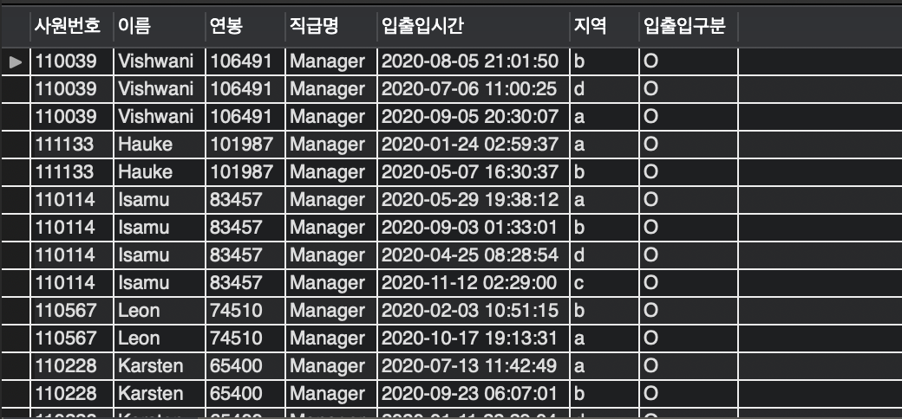

__시간 측정__

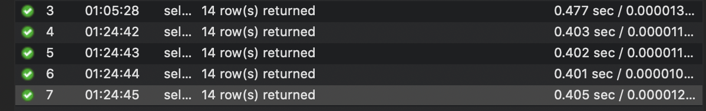

평균 0.4s로 1s 이하로 반환하는 것을 확인할 수 있다.

<br>

2. 인덱스 설정을 추가하여 50 ms 이하로 반환한다.

__인덱스 설정__

```sql
create index IDX_사원번호 on 사원출입기록(사원번호)
```

__시간 측정__

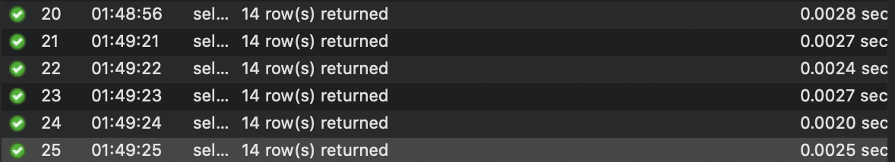

평균 0.0025s로 0.05s 이하로 반환하는 것을 확인할 수 있다.

<br>

# B. 인덱스 설계

## 주어진 데이터셋을 활용하여 아래 조회 결과를 100ms 이하로 반환

- [x] Coding as a Hobby 와 같은 결과를 반환하세요.

__쿼리문__

```sql
select
round(count(case when hobby = 'Yes' then 1 end)/count(*)100,1) as YES,
round(count(case when hobby = 'No' then 1 end)/count()*100,1) as No
from programmer
```

__인덱스 설정__
```sql
CREATE INDEX idx_hobby ON programmer(hobby);
```

__결과 테이블__

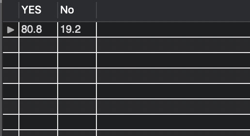

__시간 측정__

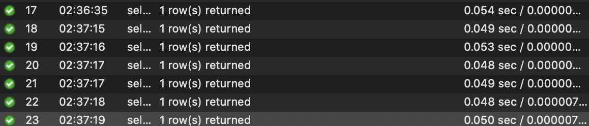

평균 0.05s로 0.1s 이하로 반환하는 것을 확인할 수 있다.

<br>

- [x] 프로그래머별로 해당하는 병원 이름을 반환하세요. (covid.id, hospital.name)

__쿼리문__

```sql
select covid.programmer_id, covid.id as covid_id, hospital.name as 병원이름
from covid
inner join hospital on covid.hospital_id = hospital.id
```

__인덱스 설정__

```sql
CREATE INDEX idx_covid_programmer ON covid(programmer_id);
CREATE INDEX idx_covid_hospital ON covid(hospital_id);
```

__결과 테이블__

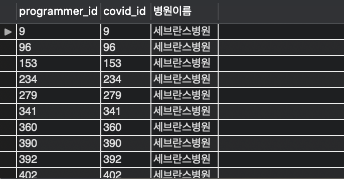

__시간 측정__


평균 0.004s로 0.1s 이하로 반환하는 것을 확인할 수 있다.

<br>

- [x] 프로그래밍이 취미인 학생 혹은 주니어(0-2년)들이 다닌 병원 이름을 반환하고 user.id 기준으로 정렬하세요. (covid.id, hospital.name, user.Hobby, user.DevType, user.YearsCoding)

__쿼리문__

```sql
select covid.id as covid_id, hospital.name, programmer.id as programmer_id, programmer.hobby, programmer.dev_type, programmer.years_coding
from programmer
    inner join covid on covid.programmer_id = programmer.id
    inner join hospital on covid.hospital_id = hospital.id
where (programmer.student <> "No" and hobby = "Yes")
OR (programmer.years_coding = "0-2 years")
```

__인덱스 설정__

```sql
CREATE INDEX idx_covid_programmer ON covid(programmer_id);
CREATE INDEX idx_covid_hospital ON covid(hospital_id);
```

__결과 테이블__

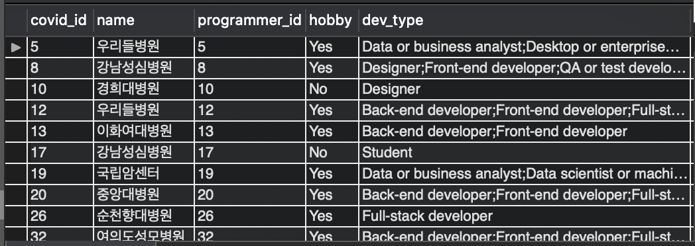

__시간 측정__

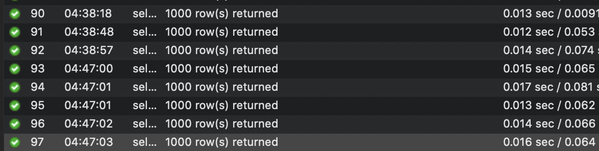

평균 0.015s로 0.1s 이하로 반환하는 것을 확인할 수 있다.

<br>

- [x] 서울대병원에 다닌 20대 India 환자들을 병원에 머문 기간별로 집계하세요. (covid.Stay)

__쿼리문__

```sql
select covid.stay, count(covid.stay)
from (select programmer.id as p_id
    from programmer
    where programmer.country = "india") as india_id
    inner join covid on india_id.p_id = covid.programmer_id
    inner join hospital on covid.hospital_id = hospital.id
    inner join member on covid.member_id = member.id
where hospital.name = "서울대병원" and (member.age between 20 and 29)
group by covid.stay
```

__결과 테이블__

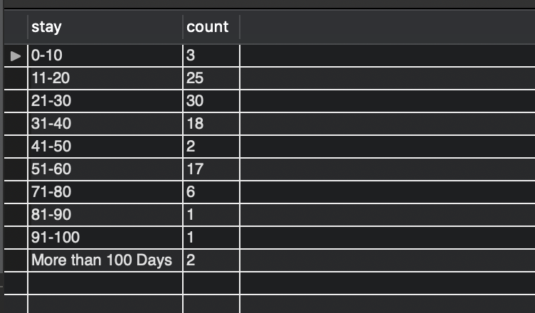

__시간 측정__

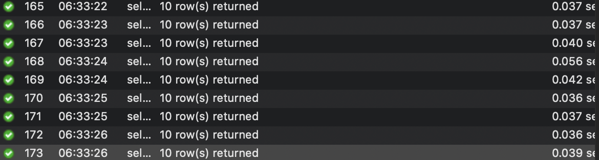

평균 0.04s로 0.1s 이하로 반환하는 것을 확인할 수 있다.

<br>

- [x] 서울대병원에 다닌 30대 환자들을 운동 횟수별로 집계하세요. (user.Exercise)

__쿼리문__

```sql
select programmer.exercise, count(programmer.exercise)
    from
    (select covid.id as c_id, member.age, hospital.name, covid.programmer_id as p_id
    from covid
    inner join hospital on covid.hospital_id = hospital.id
    inner join member on covid.member_id = member.id
    where (member.age between 30 and 39) and hospital.name = "서울대병원"
    ) as user
inner join programmer on user.p_id = programmer.id
group by programmer.exercise
```

__인덱스 설정__

```sql
create index idx_covid on covid(programmer_id, hospital_id, member_id)
create index idx_hospital on hospital(name(500))
create index idx_member on member(id, age)
create index idx_programmer on programmer(id, exercise(500))
```

__결과 테이블__

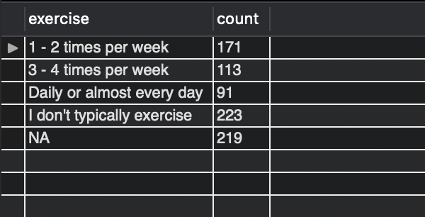

__시간 측정__

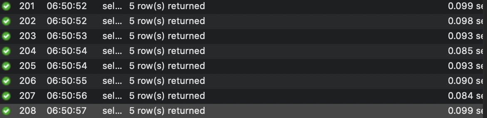

평균 0.09s로 0.1s 이하로 반환하는 것을 확인할 수 있다.

