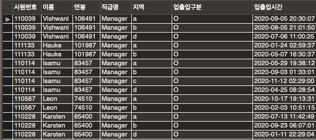
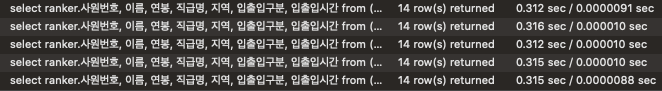
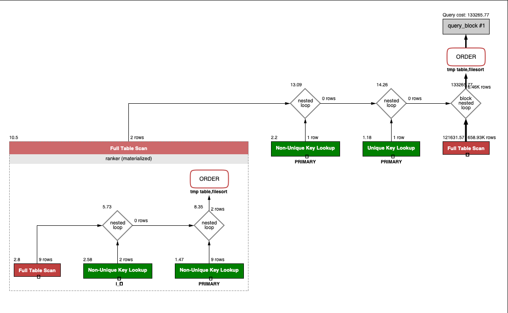
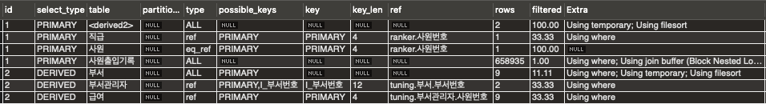
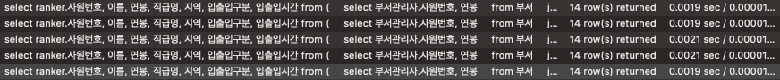
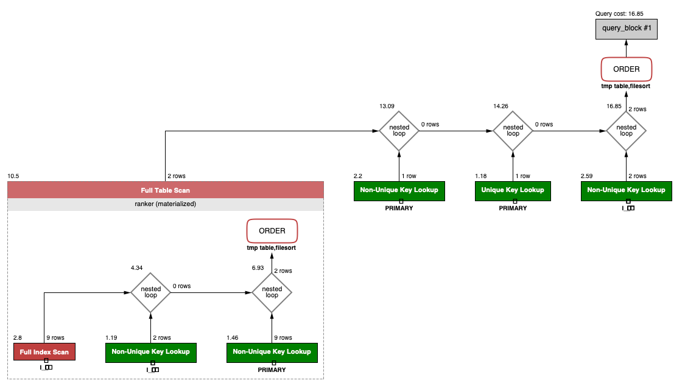
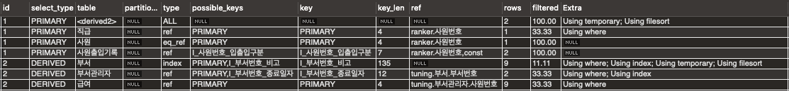

## 문제
```
활동중인(Active) 부서의 현재 부서관리자 중 연봉 상위 5위안에 드는 사람들이 
최근에 각 지역별로 언제 퇴실했는지 조회해보세요. 
(사원번호, 이름, 연봉, 직급명, 지역, 입출입구분, 입출입시간)
```

### 1. 쿼리 작성만으로 1s 이하로 반환한다.

##### - 접근 방향 
```
- 활동중인 부서의 관리자 중 상위 연봉 5명을 먼저 찾아서 수를 줄여야겠다는 생각을 함.
- 처음에는 where 사원번호 in (5명을 뽑는 서브쿼리) 방향으로 진행했으나 연봉을 서브쿼리 외부로 가지고 나가기 까다로워서 
- 현재의 구조인 from (5명을 뽑는 서브쿼리)가 되었음
```

#### - 쿼리
```sql
select ranker.사원번호, 이름, 연봉, 직급명, 지역, 입출입구분, 입출입시간
from
(
    select 부서관리자.사원번호, 연봉
    from 부서
    join 부서관리자
    on 부서.부서번호 = 부서관리자.부서번호 and 부서.비고 = 'active' and curdate() < 부서관리자.종료일자
    join 급여
    on 부서관리자.사원번호 = 급여.사원번호 and curdate() < 급여.종료일자
    order by 연봉 desc
    limit 5
)ranker
join 사원출입기록
on ranker.사원번호 = 사원출입기록.사원번호 and 사원출입기록.입출입구분 = 'O'
join 직급
on ranker.사원번호 = 직급.사원번호 and curdate() < 직급.종료일자
join 사원
on ranker.사원번호 = 사원.사원번호
order by 연봉 desc, 지역 asc;
```

#### - 결과
 <br>

#### - 시간  
 <br>

#### - 계획
 <br>
 <br>

### 2. 인덱스 설정을 추가하여 50ms 이하로 반환한다.

#### 접근 방향
#### 인덱스 추가
```sql
-- 서브쿼리 부분 데이터가 적어서 별 효과가 없음
create index `I_부서번호_종료일자`  on `tuning`.`부서관리자` (부서번호, 종료일자)
drop index `I_부서번호`  on `tuning`.`부서관리자`;
create unique index `I_부서번호_비고`  on `tuning`.`부서` (부서번호, 비고)

-- using temporary, filesort 없애고 싶어서 넣었는데 안 없어짐  
create index `I_연봉`  on `tuning`.`급여` (연봉)

-- 바깥 쿼리 부분
create index `I_사원번호_입출입구분`  on `tuning`.`사원출입기록` (사원번호, 입출입구분)

```
#### - 시간
 <br>

#### - 계획
 <br>
 <br>
