# SQL 튜닝

## 1. 쿼리 연습

### 쿼리

```sql
select 사원정보.사원번호 as 사원번호, 이름, 연봉, 직급명, 입출입시간, 지역, 입출입구분
from (
	select 사원번호연봉.사원번호 as 사원번호, 이름, 연봉, 직급명
	from (
		select 관리자사원번호.사원번호 as 사원번호, 연봉
		from (
			select 사원번호
			from (select 부서번호 from 부서 where 비고 = 'active') as 활성부서
			join 부서관리자 
			on 부서관리자.부서번호 = 활성부서.부서번호
            AND 종료일자 = '9999-01-01'
		) as 관리자사원번호
		join (
			select 사원번호, 연봉
			from 급여
			where 종료일자 = '9999-01-01'
		) as 최근급여
		on 관리자사원번호.사원번호 = 최근급여.사원번호
        order by 연봉 desc
		limit 0, 5
	) as 사원번호연봉
	join (
		select 사원.사원번호, 이름, 직급명
		from 사원
		join 직급
		on 직급.사원번호 = 사원.사원번호
		where 종료일자 = '9999-01-01'
		) as 사원이름직급명
	on 사원이름직급명.사원번호 = 사원번호연봉.사원번호
) as 사원정보
join 사원출입기록
on 입출입구분 = 'O'
and 사원정보.사원번호 = 사원출입기록.사원번호 
order by 연봉 desc
```

### 인덱스 전 비용

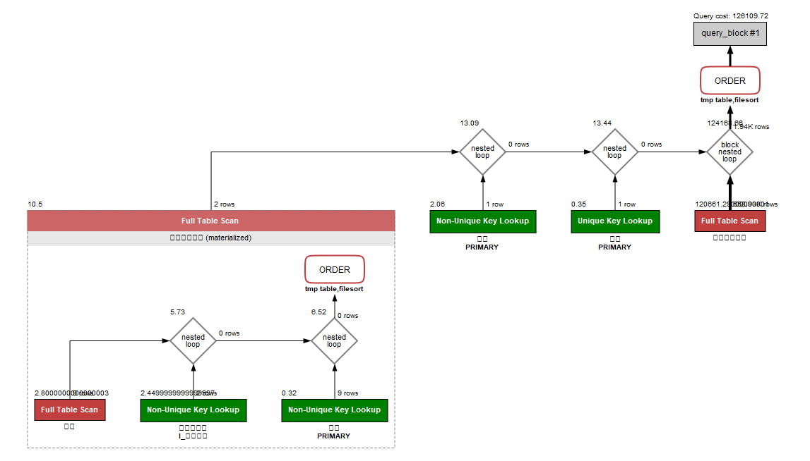

### 인덱스 전 시간


### 적용 인덱스

사원출입기록 -> (입출력구분, 사원번호)


### 인덱스 후 비용

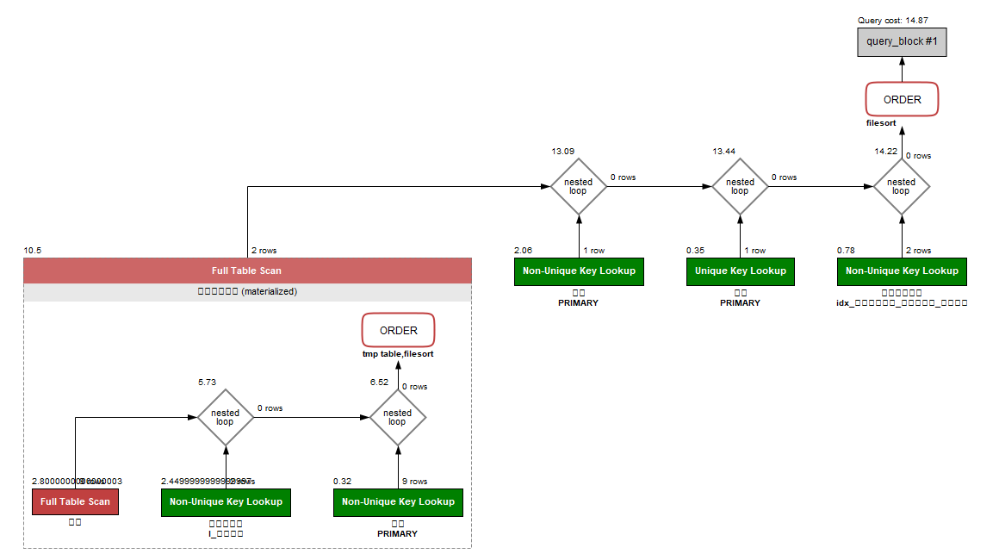

### 인덱스 후 시간

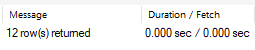

### 출력결과

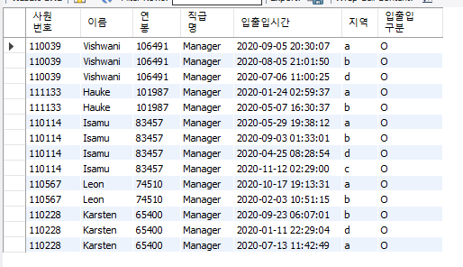


## 2. 인덱스 설계

### 2-1. Coding as a Hobby와 같은 결과를 반환

#### 쿼리

```sql
select hobby, count(hobby) * 100 / (select count(*) from programmer) as percentage
from programmer
group by hobby
order by hobby desc
```

#### 적용 인덱스

programmer -> hobby

#### 비용

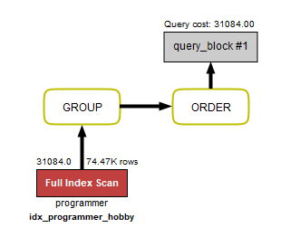

#### 시간

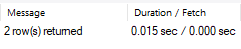

#### 출력결과

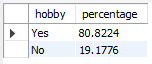


### 2-2 프로그래머별로 해당하는 병원 이름을 반환

#### 쿼리

```sql
select name as hospital_name, programmer_id 
from hospital
join covid
on hospital.id = hospital_id 
and programmer_id is not null 
```


#### 적용 인덱스

hospital -> id(pk)

covid -> (hospital_id, programmer_id,)

#### 비용

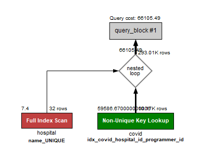

#### 시간

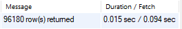

#### 출력결과

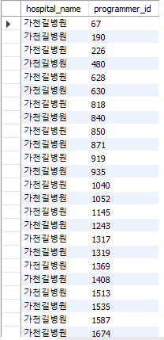


### 2-3 프로그래밍이 취미인 학생 혹은 주니어(2년 이하)들이 다닌 병원 이름을 반환하고 user.id 기준으로 정렬

#### 쿼리

```sql
select hospital_name, programmer_id, dev_type, years_coding
from programmer
join (
	select name as hospital_name, programmer_id 
	from hospital
	join covid
	on hospital.id = hospital_id
) as covid_info
on programmer_id = id
and hobby = 'YES'
and (dev_type like '%Student%'
or years_coding = '0-2 years')
```

#### 적용 인덱스

hospital -> id(pk)

covid -> (programmer_id, hospital_id) 

#### 비용

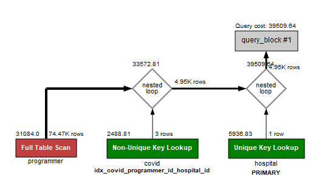

#### 시간

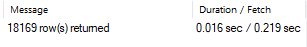

#### 출력결과

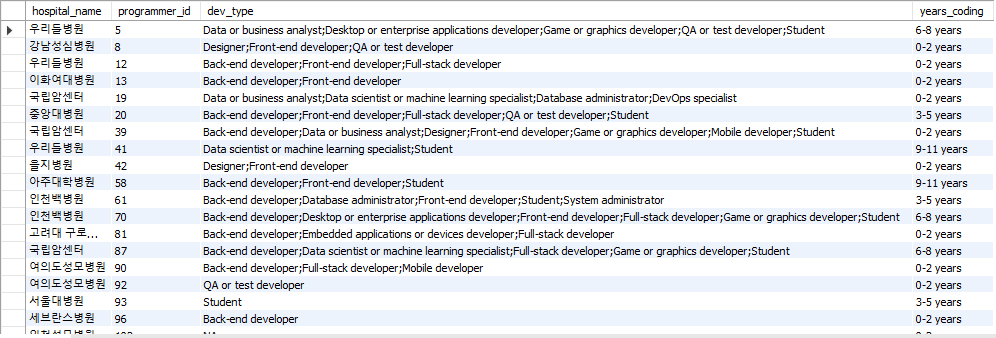


### 2-4 서울대병원에 다닌 20대 India 환자들을 병원에 머문 기간별로 집계

#### 쿼리

```SQL
select stay, count(*)
from (select id
from member
where age between 20 and 29) as member_info
join covid
on covid.id = member_info.id
join hospital
on name = '서울대병원'
and hospital.id = covid.hospital_id
join programmer
on programmer.id = programmer_id
and country = 'India'
group by stay
order by null
```

#### 적용 인덱스

hostpital -> name(unique)

covid -> hospital_id

#### 비용

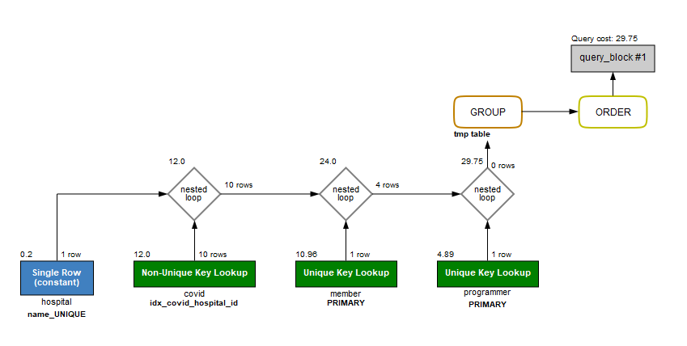

#### 시간

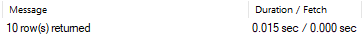

#### 출력결과

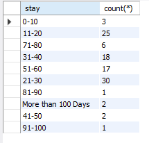


### 2-5 서울대병원에 다닌 30대 환자들을 운동 횟수별로 집계

#### 쿼리

```sql
select exercise, count(*)
from (
	select id 
    from member 
    where age between 30 and 39
    ) as member_info
join covid
on covid.member_id = member_info.id
join hospital
on name = '서울대병원'
and hospital.id = covid.hospital_id
join programmer
on programmer.id = covid.programmer_id
group by exercise
order by null
```


#### 적용 인덱스

hostpital -> name(unique)

covid -> hospital_id, programmer_id

#### 비용

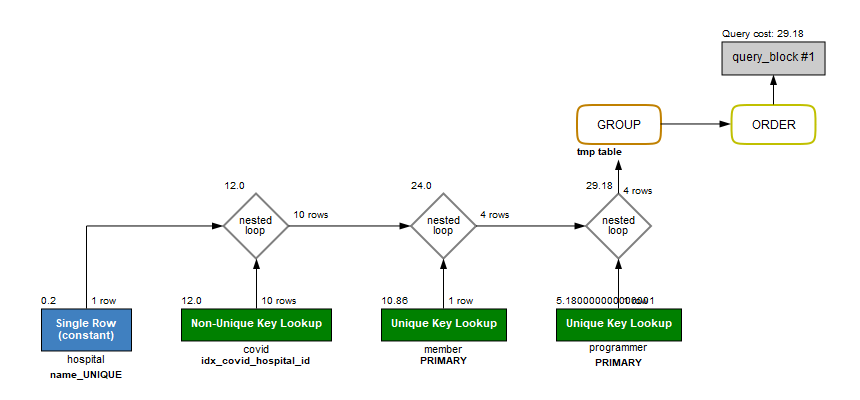

#### 시간

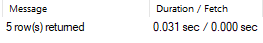

#### 출력결과

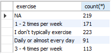

