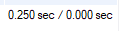
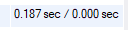
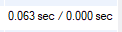
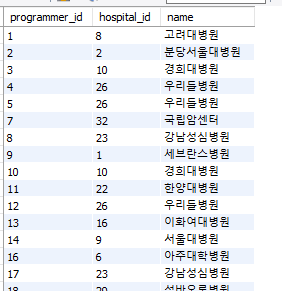

# A. 쿼리 연습

## 1. 쿼리 작성만으로 1s 이하로 반환된다.

- SQL문

```sql
SELECT 사원출입기록.사원번호, 
    ANY_VALUE(고연봉관리자.이름) as 이름, 
    ANY_VALUE(고연봉관리자.연봉) as 연봉, 
    ANY_VALUE(고연봉관리자.직급명) as 직급명, 
    MAX(사원출입기록.입출입시간) as 입출입시간, 
    사원출입기록.지역, 
    ANY_VALUE(사원출입기록.입출입구분) as 입출입구분 
FROM 사원출입기록
    JOIN (SELECT 부서관리자.사원번호, 사원.이름, 급여.연봉, 직급.직급명
        FROM 부서
            JOIN 부서관리자 ON 부서.부서번호 = 부서관리자.부서번호
            JOIN 급여 ON 부서관리자.사원번호 = 급여.사원번호
            JOIN 사원 ON 사원.사원번호 = 부서관리자.사원번호
            JOIN 직급 ON 직급.사원번호 = 부서관리자.사원번호
        WHERE 비고 = 'active'
            AND current_date() BETWEEN 부서관리자.시작일자 AND 부서관리자.종료일자
            AND current_date() BETWEEN 급여.시작일자 AND 급여.종료일자
            AND current_date() BETWEEN 직급.시작일자 AND 직급.종료일자
        ORDER BY 급여.연봉 DESC
        LIMIT 5) 고연봉관리자 ON 고연봉관리자.사원번호 = 사원출입기록.사원번호
WHERE 사원출입기록.입출입구분 = 'O'
GROUP BY 사원출입기록.사원번호, 사원출입기록.지역
ORDER BY NULL;
```

- 실행 계획
  


- 실행 결과



## 2. 인덱스 설정을 추가하여 50 ms 이하로 반환한다.

```sql
ALTER TABLE 사원출입기록 ADD INDEX I_입출입구분_사원번호_지역 (입출입구분, 사원번호, 지역);
```

- 실행 계획


- 실행 결과
  


# B. 인덱스 설계

인덱스 구성
```sql
ALTER TABLE programmer ADD INDEX I_hobby (hobby);
ALTER TABLE programmer ADD INDEX I_dev_type_hobby (dev_type(200), hobby);
ALTER TABLE programmer ADD INDEX I_years_coding (years_coding);
ALTER TABLE programmer ADD INDEX I_country (country);
ALTER TABLE programmer ADD CONSTRAINT PRIMARY KEY (id);
ALTER TABLE covid ADD INDEX I_programmer_id_hospital_id_stay (programmer_id, hospital_id, stay);
ALTER TABLE hospital ADD INDEX I_name (name(200));
ALTER TABLE hospital ADD CONSTRAINT PRIMARY KEY (id);
```

## Coding as a Hobby 와 같은 결과를 반환하세요.

```sql
SELECT hobby, count(1) * 100 / (SELECT count(1) FROM programmer) AS percentage
FROM programmer
GROUP BY hobby
ORDER BY NULL;
```

- 실행 계획


- 실행 결과


## 프로그래머별로 해당하는 병원 이름을 반환하세요.

```sql
SELECT covid.programmer_id, hospital.name 
FROM covid
    JOIN hospital ON hospital.id = covid.hospital_id
WHERE covid.programmer_id IS NOT NULL;
```

- 실행 계획
  


- 실행 결과


## 프로그래밍이 취미인 학생 혹은 주니어(0-2년)들이 다닌 병원 이름을 반환하고 user.id 기준으로 정렬하세요. 

```sql
SELECT young_programmer.id, hospital.name
FROM covid
    JOIN (SELECT programmer.id
        FROM programmer
        WHERE programmer.dev_type = 'Student' 
	        AND programmer.hobby = 'Yes'
        UNION ALL
        SELECT programmer.id
        FROM programmer
        WHERE programmer.years_coding = '0-2 years') young_programmer ON young_programmer.id = covid.programmer_id
    JOIN hospital ON hospital.id = covid.hospital_id
ORDER BY young_programmer.id;
```

- 실행 계획



- 실행 결과



## 서울대병원에 다닌 20대 India 환자들을 병원에 머문 기간별로 집계하세요.

```sql
SELECT covid.stay, count(1) as count
FROM hospital
    INNER JOIN covid ON covid.hospital_id = hospital.id 
    INNER JOIN programmer ON programmer.id = covid.programmer_id
WHERE hospital.name = '서울대병원'
    AND programmer.country = 'India'
GROUP BY covid.stay
ORDER BY NULL;
```

- 실행 계획


- 실행 결과


## 서울대병원에 다닌 30대 환자들을 운동 횟수별로 집계하세요. 

```sql
SELECT programmer.exercise, count(1) as count
FROM hospital
    INNER JOIN covid ON covid.hospital_id = hospital.id
    INNER JOIN programmer ON programmer.id = covid.programmer_id
WHERE hospital.name = '서울대병원'
GROUP BY programmer.exercise
ORDER BY NULL;
```

- 실행 계획


  
- 실행 결과


