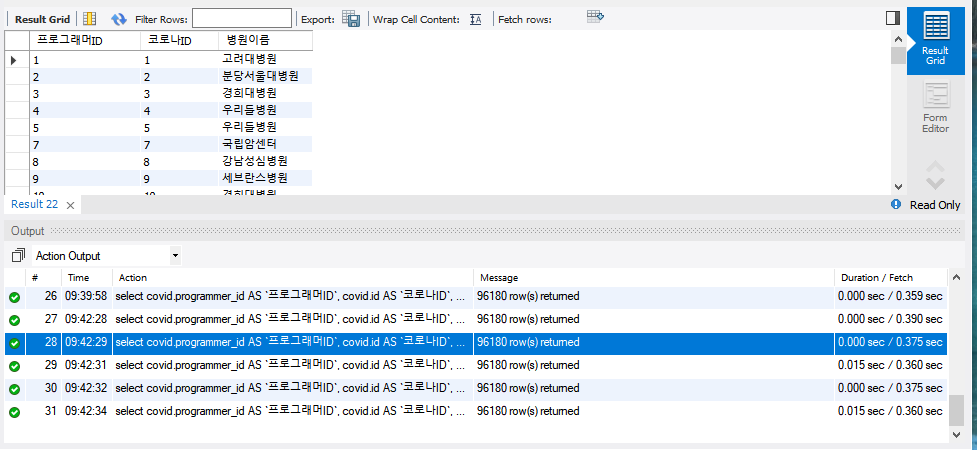
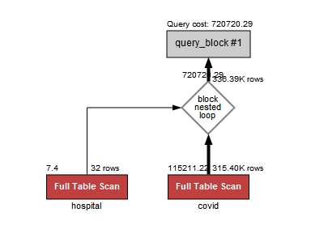
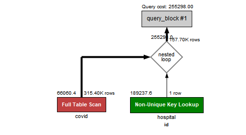

### B. 인덱스 설계
#### [2. 프로그래머별로 해당하는 병원 이름을 반환하세요. (covid.id, hospital.name)]
##### 여기서 뻘짓은 fetch time과 duration time을 구분 못해 발생했습니다
- **다음과 같이 쿼리를 작성했어요**
    ```mysql
    select covid.programmer_id AS `프로그래머ID`, covid.id AS `코로나ID`, hospital.name AS `병원이름` 
        from covid 
            join hospital 
                on covid.hospital_id = hospital.id
        where covid.programmer_id > 0;
    ```

- **인덱스를 적용하지 않은 경우, 대략 370ms 정도 소요되어요**
    - 
    - 실행 계획은 다음과 같아요. 
        - 

- **인덱스를 적용해볼게요**
    - join 하는 칼럼에 대해서 인덱스가 필요하다고 생각했어요. 
        ```mysql
        create index `id` on hospital (`id`);
        create index `hospital_id` on covid(`hospital_id`);
        ```
        - 이거만 적용해서는 별로 조회성능이 향상되지 않았어요. 약 330ms 정도 소요되어요. 아마 hospital 테이블 자체의 데이터 셋이 작아서 인덱스의 혜택을 크게 못받은 것 같아요. 
    - where 절에서 조건에 따라 계산하는 칼럼에도 인덱스가 필요하다고 생각했어요. 
        ```mysql
        create index `programmer_id` on covid(`programmer_id`);
        ```
        - 이걸 적용했는데도 크게 나아지지 않네요...? 그냥 비슷하게 330ms 정도 소요되어요. 
    - 실행계획을 살펴볼게요
        -     
        - 여전히 풀 테이블 스캔이 진행되네요. 
        - 아... Join 한 테이블에 대해 where를 진행하니까 인덱스의 혜택을 못받는 거 같아요
        
- **쿼리가 문제인 것 같아서 변경했어요**
    - where절을 covid, hospital 테이블을 join한 테이블에 계산시켰어요. 
        - 인덱스의 혜택을 받기 어렵다고 판단했어요.   
    ```mysql
    select shortenCovid.programmer_id AS `프로그래머ID`, shortenCovid.id AS `코로나ID`, hospital.name AS `병원이름`
        from (select programmer_id, hospital_id , id from covid where programmer_id > 0) AS shortenCovid 
            join hospital 
                on hospital.id = shortenCovid.hospital_id;
    ```
