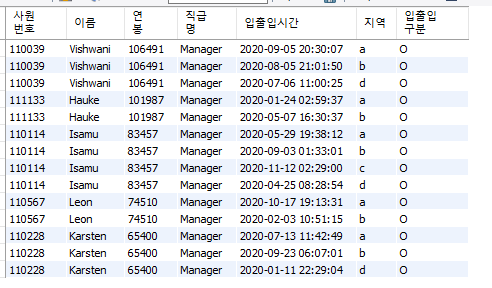
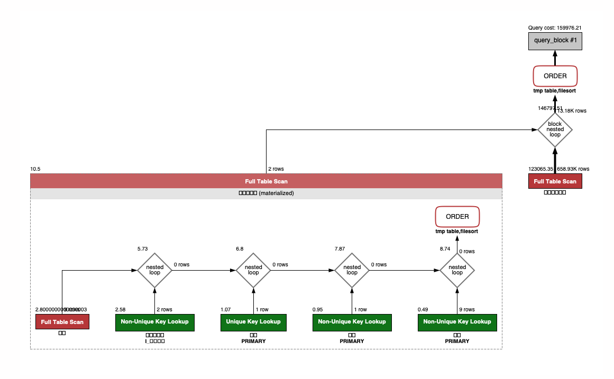
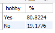
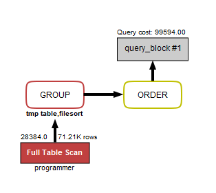
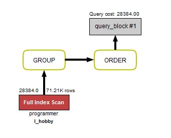
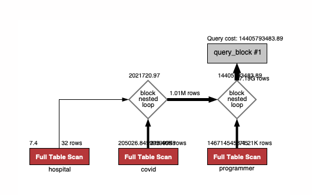
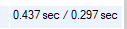
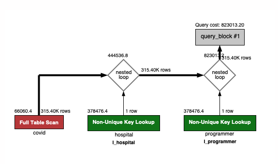
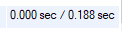
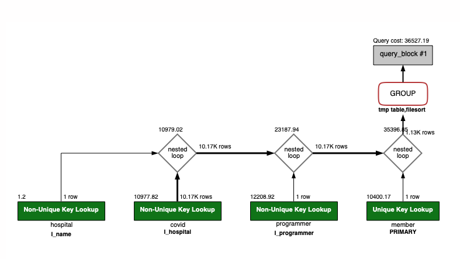

## SQL 쿼리 미션

### A. 쿼리 연습

1. 쿼리 작성만으로 1s 이하로 반환한다.
2. 인덱스 설정을 추가하여 50 ms 이하로 반환한다.
- 활동중인(Active) 부서의 현재 부서관리자 중 연봉 상위 5위안에 드는 사람들이 최근에 각 지역별로 언제 퇴실했는지 조회해보세요.(사원번호, 이름, 연봉, 직급명, 지역, 입출입구분, 입출입시간)
  
    ```sql
    select 관리자정보.사원번호, 이름, 연봉, 직급명, 입출입시간, 지역, 입출입구분
    from (
    	select 사원.사원번호, 사원.이름, 연봉, 직급.직급명
    	from 사원
    	join (
    		select 부서관리자.사원번호, 부서관리자.종료일자
    		from 부서관리자
    		join (select 부서번호 from 부서 where 비고 = 'active') 활동중인_부서 
    		on 활동중인_부서.부서번호 = 부서관리자.부서번호
    	) 부서관리자 on 부서관리자.사원번호 = 사원.사원번호
    	join 직급 on 직급.사원번호 = 사원.사원번호
    	join 급여 on 급여.사원번호 = 사원.사원번호
    	where 직급명 = 'manager' 
    		and 직급.종료일자 >= current_date()
    		and 급여.종료일자 >= current_date()
    		and 부서관리자.종료일자 >= current_date()
    	order by 연봉 desc limit 5
    ) as 관리자정보
    join 사원출입기록 on 사원출입기록.사원번호 = 관리자정보.사원번호
    where 입출입구분 = 'o'
    order by 연봉 desc
    ```
    
    
    
    
    
    
    
    ```sql
    create index I_입출입구분 on 사원출입기록 (입출입구분)
    ```
    
    
    

### B. 인덱스 설계

주어진 데이터셋을 활용하여 아래 조회 결과를 100ms 이하로 반환

- [Coding as a Hobby](https://insights.stackoverflow.com/survey/2018#developer-profile-_-coding-as-a-hobby) 와 같은 결과를 반환하세요.
  
    ```sql
    select hobby, count(hobby) / (select count(*) from programmer) * 100 as '%'
    from programmer
    group by hobby
    order by hobby desc
    ```
    
    
    
    
    
    
    
    ```sql
    create index I_hobby on programmer (hobby)
    ```
    
    
    
    
    
- 프로그래머별로 해당하는 병원 이름을 반환하세요. (covid.id, hospital.name)
  
    ```sql
    select programmer_id, hospital_id, hospital.name
    from covid
    join hospital on hospital.id = hospital_id
    join programmer on programmer.id = programmer_id
    
    select programmer.id, hospital_id, hospital.name
    from programmer
    join covid on covid.programmer_id = programmer.id
    join hospital on hospital.id = covid.hospital_id
    ```
    
    
    
    
    
    
    
    ```sql
    create index I_hospital on hospital (id);
    create index I_programmer on programmer (id);
    ```
    
    
    
    
    
- 프로그래밍이 취미인 학생 혹은 주니어(0-2년)들이 다닌 병원 이름을 반환하고 user.id 기준으로 정렬하세요. (covid.id, hospital.name, user.Hobby, user.DevType, user.YearsCoding)
  
    ```sql
    select programmer.id, hospital.name
    from programmer
    join covid on covid.programmer_id = programmer.id
    join hospital on hospital.id = covid.hospital_id
    where years_coding = '0-2 years' and dev_type like '%student%' and hobby = 'Yes'
    ```
    
    
    
    
    
    
    
    ```sql
    create index I_programmer on covid (programmer_id);
    ```
    
    
    
    
    
    ```sql
    create index I_years_hobby on programmer (years_coding, hobby);
    ```
    
    
    
    
    
- 서울대병원에 다닌 20대 India 환자들을 병원에 머문 기간별로 집계하세요. (covid.Stay)
  
    ```sql
    select stay, count(*) from covid
    join member on member.id = covid.member_id
    join programmer on programmer.id = covid.programmer_id
    join hospital on hospital.id = covid.hospital_id
    where hospital.name = '서울대병원' 
    	and programmer.country = 'India' 
    	and member.age between 20 and 29
    group by stay
    ```
    
    
    
    
    
    
    
    ```sql
    create index I_name on hospital (name(100));
    create index I_hospital on covid (hospital_id);
    ```
    
    
    
    
    
- 서울대병원에 다닌 30대 환자들을 운동 횟수별로 집계하세요. (user.Exercise)
  
    ```sql
    select exercise, count(exercise) from programmer
    join member on member.id = programmer.member_id
    join covid on covid.programmer_id = programmer.id
    join hospital on hospital.id = covid.hospital_id
    where hospital.name = '서울대병원' 
    	and member.age between 30 and 39
    group by exercise
    ```
    
    
    
    
    
    